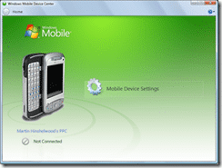
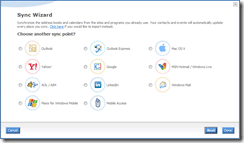
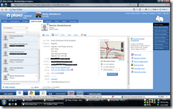
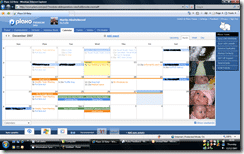

Over the past year of using the [Windows Mobile Device Center](http://www.microsoft.com/windowsmobile/devicecenter.mspx) on Vista as well as [ActiveSync 4.5](http://www.microsoft.com/windowsmobile/activesync/default.mspx) I have become increasingly disillusioned with them both and searching for another tool that would do the job better.

## Why Mobile Device Center is a bit pants!

I have found that it has become increasingly difficult to connect my mobile to this software and I have had to hard reset my phone a number of times to get it to work again. At the moment it just does not connect at all to my laptop at home, which is just as well as I would end up with a multitude of duplicate contacts ever time I sync between two mobile. And not just my contacts, at some points I have had my phone go off at midnight (when I am sleeping) with five or six birthday alerts for the same person!

[ActiveSync](http://www.microsoft.com/windowsmobile/activesync/default.mspx) has many of the same problems...

## Interim Solutions

I even went through a phase of installing [Exchange 2003](http://en.wikipedia.org/wiki/Microsoft_Exchange_Server) and [Active Directory](http://en.wikipedia.org/wiki/Active_Directory) on my server just to use [Exchange ActiveSync](http://technet.microsoft.com/en-us/library/aa998357.aspx)...Which is cool, and useful.. But not really worth the overhead of managing it at home.

I wanted to go further and have my contacts update their own information. So I started using [LinkedIn](http://www.linkedin.com/in/martinhinshelwood) as a contact repository, and using the [LinkedIn Outlook toolbar](http://www.linkedin.com/static?key=outlook_toolbar_download&trk=ftr_otb) I had a lot of success. I have used [LinkedIn](http://www.linkedin.com/in/martinhinshelwood) for this purpose for a couple of years now, but I am now finding that I have a multitude of these collaboration sites under my belt, and I really need a tool that sync's with all my online tools and my offline ones.

## A better way

 And so this leads me to [Plaxo](http://www.plaxo.com). This is by far and away the best tool I have come across. It's so good, I even paid the subscription fee to get the extra features like Mobile Sync, contact backup and others. _And you know that is not like me :)_

[Plaxo](http://www.plaxo.com) has this marvelous tool called the "De-duper". Can you imagine what it does :). And I will tell you something, I went from 1250 ish contacts to 920 without even breaking a sweat...

There are many more Syncing options available, although some are only for paid up members...

And what does [Plaxo](http://www.plaxo.com) do for me...

### **Contacts**

Plaxo provides a single point of truth for all my contacts. I can have an email sent to any of my contacts to get them to update their details, and they do not even need to be members of Plaxo to do this :).

- Sync's my Contacts from Outlook at work
- Sync's my Contacts from Outlook at home
- Sync's my contacts from my phone
- Sync's my contacts from LinkedIn (One Way)
- Sync's my contacts from Google

I get a very nice little profile ([http://martinhinshelwood.myplaxo.com](http://martinhinshelwood.myplaxo.com)) that I can control how and who can view my information.

### Calendar

I have two calendars setup on Plaxo that overlay. One for my personal and one for my Office calendar items. Both calendars applier in both my Outlook's and as I am using 2007 I can overlay them if I want to.

- Sync's my Calendar from Outlook at work
- Sync's my Calendar from Outlook at home
- Sync's my Calendar from my phone
- Sync's my Calendar from Google (One Way) \[hopefully not for long\]

My calendars are published in two formats: one that has a friendly URL ([http://martinhinshelwood.myplaxo.com/calendar](http://martinhinshelwood.myplaxo.com/calendar)) that is publicly available as a free busy publication and one that has a crazy URL that has my actual meeting subjects in them for private access.

All of my calendars are synced to my phone "over the air" in a consolidated view...

## The future

There are a number of features I would like to see in Plaxo as, although they are in beta testing of version 3 of their website (the one I am using) there are a couple of niggly things that mildly irritate me. Though I am impressed with the number and functionality of the syncs that are available. Many more than I use...

- The ability to see the last time contacts details were updated by me, and by them (even if they are not members of Plaxo)...Maybe an option to request an update from all contacts that have not updated details in 1 year.
- No notification on my windows mobile for PlaxoSync when it fails to connect unless I manually initiated a Sync.
- The ability to choose when adding an event which calendar it goes into from my phone...Currently I am not sure what will happen...
- The ability to control the viability of individual fields of information on my profiles...mainly to control what is displayed on my [http://martinhinshelwood.myplaxo.com](http://martinhinshelwood.myplaxo.com) page.
- Adding the ability to sync RSS feed lists with Outlook, IE, Google and others....

Technorati Tags: [Personal](http://technorati.com/tags/Personal) [WM6](http://technorati.com/tags/WM6)

