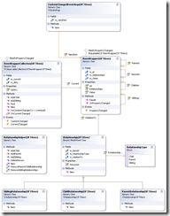

 Over the last week I have been looking at the source for the [Family.Show](http://www.vertigo.com/familyshow.aspx) application from [Vertigo](http://www.vertigo.com/). I needed to look at methods of presentation of hierarchical information graphically using WPF and I saw this as a good representation of that sort of data. So I se about not only converting it to VB.NET but adding generics to the mix.

The first part of the application is the core objects that represent the data and allow interaction in a way that WPF can handle. This means using Observable Collections and implementing INotifyPropertyChanged to allow a higher level of interaction. I wanted to support any Source object type as well as my own custom types, so the type needed to be nested with a Wrapper that gives the illusion that it is a solid type, but in actual fact it is a soft wrapper that allows the system to interact with it without really understanding the type. The specific understanding of the type is done at a much higher level.

You will need to open this diagram in a new window to get the effect, but it is a completely generic representation of Parent, Child and  Sibling relationships for any object regardless of wither you have access to the source or not.

This is not currently designed to be an editable object, but inheriting from the [ItemWrapper](http://www.codeplex.com/TFSStickyBuddy/SourceControl/FileView.aspx?itemId=157013&changeSetId=10168) class would allow this, but would require a modification to the framework to handle the inherited type. Maybe v2...

 

Technorati Tags: [.NET](http://technorati.com/tags/.NET) [WPF](http://technorati.com/tags/WPF) [Design](http://technorati.com/tags/Design) [WIT](http://technorati.com/tags/WIT) [Developing](http://technorati.com/tags/Developing)

