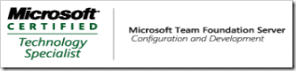

Just got my exam result for the [exam](http://hinshelwood.com/archive/2007/02/08/Beta_Exam_71_510_TS_Visual_Studio_2005_Team_Foundation_Server.aspx), and I passed! This is a single exam certification so it makes me a MCP as well as and [MCTS: Team Foundation Server](http://go.microsoft.com/?linkid=6176689).

{ .post-img }

The next step to embark on my MCPD: Enterprise which I am lookign forward to. Its strange to be looking forward to studying, but I study every day anyway to just do my job, and there is a prize at the end!

Technorati Tags: [ALM](http://technorati.com/tags/ALM)

