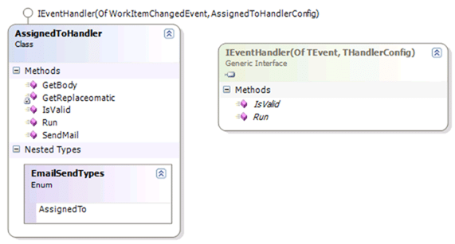

Creating an event handler with the [Team Foundation Server Event Handlers](http://www.codeplex.com/TFSEventHandler/) is very easy. You will need to inherit from the AEventHandler class which is part of [RDdotNet](http://www.rddotnet.com "RDdotNet - Reality Dysfunction .NET").TeamFoundation.dll located in the install directory (I will make an SDK later).

[](http://blog.hinshelwood.com/files/2011/06/GWB-WindowsLiveWriter-CreatingyourownEventHandler_DC01-image.png)
{ .post-img }

```
Imports Microsoft.TeamFoundation.Client

Public MustInherit Class AEventHandler(Of TEvent)

    Public MustOverride Sub Run(ByVal EventHandlerItem As EventHandlerItem(Of TEvent), _                                 ByVal ServiceHost As ServiceHostItem, _                                ByVal TeamServer As TeamServerItem, _                                ByVal e As NotifyEventArgs(Of TEvent))
    Public MustOverride Function IsValid(ByVal EventHandlerItem As EventHandlerItem(Of TEvent), _                                         ByVal ServiceHost As ServiceHostItem, _                                         ByVal TeamServer As TeamServerItem, _                                         ByVal e As NotifyEventArgs(Of TEvent)) As Boolean  End Class
```

Both of the methods that the AEventHandler exposes have the same signature. Hear is what it all means...

<table width="666" border="1" cellspacing="0" cellpadding="2" unselectable="on"><tbody><tr><td width="139" valign="top"><strong>Name</strong></td><td width="196" valign="top"><strong>Type</strong></td><td width="329" valign="top"><strong>Description</strong></td></tr><tr><td width="139" valign="top">EventHandlerItem</td><td width="193" valign="top">EventHandlerItem(<span style="color: rgb(0, 0, 255);">Of</span> TEvent)</td><td width="334" valign="top">The event handler item contains information about the handler. This includes an instance of the config data, the handler its self and a status property. The TEvent generic makes sure that everything is strongly types for the event that you are dealing with.</td></tr><tr><td width="139" valign="top">ServiceHost</td><td width="190" valign="top">ServiceHostItem</td><td width="337" valign="top">Base Address of the service, Event Type, Host Config data and a link to the service host object.</td></tr><tr><td width="139" valign="top">TeamServer</td><td width="188" valign="top">TeamServerItem</td><td width="339" valign="top">Config data for the team server as well as an instance of the Microsoft.TeamFoundation.TeamFoundationServer object</td></tr><tr><td width="138" valign="top">e</td><td width="187" valign="top">NotifyEventArgs(<span style="color: rgb(0, 0, 255);">Of</span> TEvent)</td><td width="342" valign="top">This object allows access to all of the event specific data including the event object, the event type, the <a title="Team Foundation Server" target="_blank" href="http://msdn2.microsoft.com/en-us/teamsystem/aa718934.aspx">TFS</a> Identity object and the TFS Subscription object.</td></tr></tbody></table>

Lets look at the implementation that comes with the [TFS Event Handler](http://www.codeplex.com/TFSEventHandler/), the "AssignedToHandler". The IsValid method denotes wither the handler will acrualy run at all:

```
    Public Overrides Function IsValid(ByVal EventHandlerItem As EventHandlerItem(Of WorkItemChangedEvent), _                                      ByVal ServiceHost As ServiceHostItem, _                                      ByVal TeamServer As TeamServerItem, _                                      ByVal e As NotifyEventArgs(Of WorkItemChangedEvent)) As Boolean         If e.Event Is Nothing Then             Return False         End If         Dim assignedName As String = WorkItemEventQuerys.GetAssignedToName(e.Event)
        If String.IsNullOrEmpty(assignedName) Then             Return False         Else             Return Not assignedName = WorkItemEventQuerys.GetChangedByName(e.Event)
        End If     End Function
```

This method initially checks to see if the event exists and then queries the assigned name from the event using a work item event query which consists of:

```
Return eventData.CoreFields.StringFields.Find(New Predicate(Of StringField)(AddressOf FindAssignedTo)).NewValue
```

All this does is search the String fields associated with the core work item bits to find the "System.AssignedTo" value. You could so this manually, but I have a number of queries there and you can add any number you wish.

The logic: If Event exists and assigned name is not empty then check that the assigned name is not the changed name.

So in English with all of the crap split out: Did the user assign the work item to himself? If not then send them an email!

The rest, as they say, is just logic. The "Run" method calls the "IsValid" and then sends an email if it is in fact valid, hardly rocket science.

Hopefully with this knowledge you will be able to make many many event handlers!

_For the delayed CTP 1 of the [TFS Event Handler](http://www.codeplex.com/TFSEventHandler/) I have changed the logic quite a lot but the same IsValid and Run methods exist. The parameters are, however slightly different. I have taken into account security and you will have to make your own connection to the TFS server using your own username and password. I have changed this to protect the security of the application as I want developers to be able to upload event handler assemblies and WF workflow without having to get access to the server. I ahve also changed it so the service that captures the events is not the same one that runs the handlers. This allows me to send the events between these services using MSMQ, thus giving the service some much needed redundancy._
