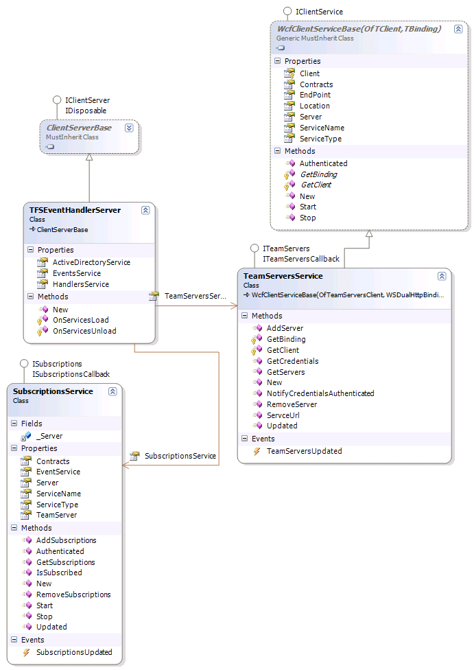

I had a plan. I wanted to create a way of accessing services in multiple locations from any location. Each location could have one or more services which may be duplications or different. That is a really abstract way of thing about it, but I eventually came up with a solution.

After using Reflector to view the Team Foundation Server source code, which gave ma many pointers for which I would like to thank the [TFS](http://msdn2.microsoft.com/en-us/teamsystem/aa718934.aspx "Team Foundation Server") Team At Microsoft, I came up with the following solution:

[](http://blog.hinshelwood.com/files/2011/06/GWB-WindowsLiveWriter-Creatingaservicemanager_8C3D-image_5.png)
{ .post-img }

This allows you to host any number of services, regardless of wither they are remote or local within a "Server" construct and to access that server easily. Remote and local services can exist side by side in the same server, for example you could have an ActiveDirectoryClientService hosted in a ClientServer

From the server level (IClientServer) you can request a service based on its type or on an interface that it implements. To achieve this the IClientService interface has a property called contracts that loops through all of the interfaces that the client service object implements and pulls out only those interfaces that have the ClientServiceContractAttribute added to them. Thus you need to make sure that all of your interfaces (e.g. ITeamServer) have that attribute regardless of wither it also has a ClientServiceContractAttribute.

From the factory level you can again request either services by type or by implementation, but this request is cross server. If you have two servers added to the factory and they both implement different contracts, you can pull any one back you like, if both servers have the same implementation you can choose wither you bring back the first or a random implementation. The potential for a load balancing solution is there but not implemented.

Below is a diagram of my TFSEventHandlerServer that included's both local and remote services. For ease of development and because it is a common thing to do I created the WcfClientServiceBase class that provides a number of features that allow less code to be written in the individual service client classes.

[](http://blog.hinshelwood.com/files/2011/06/GWB-WindowsLiveWriter-Creatingaservicemanager_8C3D-image_6.png)
{ .post-img }

In this example you can call any of the ClientServices with the same code:

Get the server with a call:

```
Dim Server As Servers.TFSEventHandlerServer
Server = Servers.ClientServerFactory.GetServer(Of Servers.TFSEventHandlerServer)(New System.Uri(http://server:6873))
```

And get client services with the Subscriptions being a local service and TeamServers is a remote one.

```
Dim Subscriptions As Clients.SubscriptionsService
Subscriptions = Server.GetService(Of Clients.SubscriptionsService)()
Dim TeamServers As Clients.TeamServersService
TeamServers = Server.GetService(Of Clients.TeamServersService)()
```

As I hope you can see this makes it easier to implement many features with an enterprise enviroment. All you have to know is what services are available where. There is also the possibility that a lookup service could be implemented that would allow the Factory to bring you services when you do not even know here they are!

I hope this helps those trying to find a way to achieve the same goals without being too restrictive. You can download the code from my [CodePlex](http://www.codeplex.com "CodePlex") [TFS Event Handler](http://www.codeplex.com/TFSEventHandler) project.
