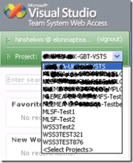

[Brian Harry](http://blogs.msdn.com/bharry/) has just [announced](http://blogs.msdn.com/bharry/archive/2007/07/30/team-system-web-access-power-tool-available.aspx "Team System Web Access Power Tool Available") the release of Team System Web Access the next incarnation of DevBiz's TeamPlain product.

I have just completed installing it on our development servers and I like it. It has much nicer features than TeamPlain 1.0 and is much more stable that 2.0RC.

I still have the old long project name problem:

 
{ .post-img }

But I already have a [solution](http://blog.hinshelwood.com/archive/2007/04/02/TeamPlain_Revisit.aspx "TeamPlain Revisit") for this, but it will probably need some modification, although I have confirmed that it works just fine with 2.0RC.

There is still the problem of not being able to go directly to a work item from an external link and this will prohibit us going into production with this. I did raise this on the Microsoft Forum for TeamPlain, but maybe it is a bigger issue.

{ .post-img }

I use my [TFS](http://msdn2.microsoft.com/en-us/teamsystem/aa718934.aspx "Team Foundation Server") Event Handler to send out an email to anyone a work item is assigned to, which could by anyone in the company (75,000 users) but in reality only those on the project get emails. The email notifies them that they have been assigned a Work item, but the link does not work with either "TeamPlain 2.0RC" or "Team System Web Access".

I think that this form of access will not become popular until an Enterprise version of TFS is released and business users can access without a CAL.

Technorati Tags: [ALM](http://technorati.com/tags/ALM) [TFS](http://technorati.com/tags/TFS)
