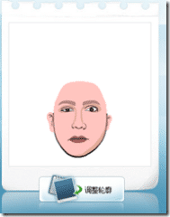

I just got a comment from Reto Winter to let me know about a [post](http://www.liveside.net/blogs/main/archive/2007/08/03/creating-custom-avatars-a-microsoft-tool-and-others.aspx "Creating custom avatars") regarding a new [Microsoft Avatar service](http://cartoon.msn.com.cn/) on MSN China, so as I am sitting here writing some posts anyway, I will have a look. It is in the same vain as the [Southparkify](http://blog.hinshelwood.com/archive/2007/07/31/Southparkify--Simposonize--better-with-both.aspx) and [Simpsonize me](http://blog.hinshelwood.com/archive/2007/07/30/Simpsonize-Me.aspx) options that I have blogged before.

**Here is how it works**

First, learn Chinese...or just click buttons until it works, like me..

Click the start button

{ .post-img }

You will need to install an application called MSN Cartoons Beta (which is the middle button) and then click next (the bottom button) and install the active-x component.

The next task is to upload a picture to create the avatar from. To do this chick the folder on the right.

{ .post-img }

Once you have a picture uploaded, and you have highlighted your face, as you can see I am not photogenic!

{ .post-img }

You need to click the build picture button.

{ .post-img }

You will then be presented with a "select your face type" option

{ .post-img }

and once you have selected this you get a partial cartoon

{ .post-img }

To move onto the next stage you click the next button again

{ .post-img }

You can then select your emotion, hair and glass from the options

{ .post-img }

and the next button again

{ .post-img }

You can then save either in 98x98 or 252x252

{ .post-img }

An you are done!

Here are my pictures, but I am not sure how much they look like me!

             
{ .post-img }

Technorati Tags: [Personal](http://technorati.com/tags/Personal) [Live](http://technorati.com/tags/Live) [Answers](http://technorati.com/tags/Answers)

