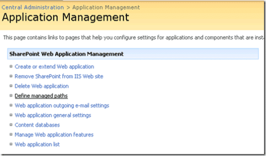
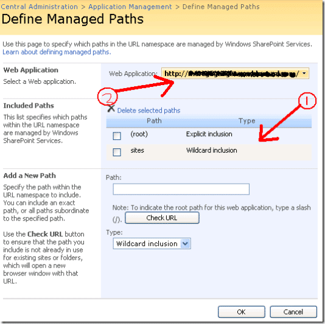

If you are trying to get team server to talk to another Sharepoint farm this is something to watch out for. I fell into this one myself, and now my American colleagues have hot the same problem (I have changed things like server, account and company names to protect the, erm, servers?). The key things to look for in the log file are the creation details:

> 2007-08-17 13:06:33Z | Module: WSS | Thread: 7 | Language id: 1033  
> 2007-08-17 13:06:36Z | Module: WSS | Thread: 7 | Verifying site template exists on the server using [http://rddotnettech.amrs.win.rddotnet.com:21617/\_vti\_bin/Sites.asmx](http://XXtech.amrs.win.XX.com:21617/_vti_bin/Sites.asmx)  
> 2007-08-17 13:06:45Z | Module: WSS | Thread: 7 | Creating site with the following parameters  
> 2007-08-17 13:06:45Z | Module: WSS | Thread: 7 | Admin Url: [http://rddotnettech.amrs.win.rddotnet.com:21617/\_vti\_adm/admin.asmx](http://XXtech.amrs.win.XX.com:21617/_vti_adm/admin.asmx)  
> 2007-08-17 13:06:45Z | Module: WSS | Thread: 7 | Site Url: http://rddotnettech.amrs.win.rddotnet.com/sites/SDLC-QA/Test RD 08-17-2007 1305  
> 2007-08-17 13:06:45Z | Module: WSS | Thread: 7 | Site Title: Test RD 08-17-2007 1305  
> 2007-08-17 13:06:45Z | Module: WSS | Thread: 7 | Site Description: This team project was created based on the 'RD SDLC Process Template for CMMI Process Improvement - v2.0' process template.  
> 2007-08-17 13:06:45Z | Module: WSS | Thread: 7 | Lcid: 1033  
> 2007-08-17 13:06:45Z | Module: WSS | Thread: 7 | Template: \_GLOBAL\_#2  
> 2007-08-17 13:06:45Z | Module: WSS | Thread: 7 | Owner Login: AMRSaperson  
> 2007-08-17 13:06:45Z | Module: WSS | Thread: 7 | Owner Name: Person, Any(CT)  
> 2007-08-17 13:06:45Z | Module: WSS | Thread: 7 | Owner Email: [Any\_Person@rddotnet.com](mailto:Any_Person@rddotnet.com)  
> 2007-08-17 13:06:45Z | Module: WSS | Thread: 7 | Portal Url:  
> 2007-08-17 13:06:45Z | Module: WSS | Thread: 7 | Portal Name:

These details will help you debug the error. As you can see above there are details for the Sharepoint portal to be created and the location of the Sharepoint sites. Check the actual error message which is always buried  in the log file:

> 'Microsoft.SharePoint.SoapServer.SoapServerException' was thrown.  
>    at System.Web.Services.Protocols.SoapHttpClientProtocol.ReadResponse(SoapClientMessage message, WebResponse response, Stream responseStream, Boolean asyncCall)  
>    at System.Web.Services.Protocols.SoapHttpClientProtocol.Invoke(String methodName, Object\[\] parameters)  
>    at Microsoft.TeamFoundation.Proxy.Portal.Admin.CreateSite(String Url, String Title, String Description, Int32 Lcid, String WebTemplate, String OwnerLogin, String OwnerName, String OwnerEmail, String PortalUrl, String PortalName)  
>    at Microsoft.VisualStudio.TeamFoundation.WssSiteCreator.CreateSite(WssSiteData siteCreationData, ProjectCreationContext context)  
>    at Microsoft.VisualStudio.TeamFoundation.WssSiteCreator.Execute(ProjectCreationContext context, XmlNode taskXml)  
> \---begin Exception entry--- 
> Time: 2007-08-17 13:06:46Z  
> Module: Engine  
> Event Description: **TF30162: Task "SharePointPortal" from Group "Portal" failed  
> **Exception Type: Microsoft.TeamFoundation.Client.PcwException  
> Exception Message: The Project Creation Wizard encountered an error while uploading documents to the Windows SharePoint Services server on uswmapsdlcq01.amrs.win.ml.com.  
> Exception Details: The Project Creation Wizard encountered a problem while uploading  
> documents to the Windows SharePoint Services server on **teamq01.amrs.win.rddotnet.com**.  
> The reason for the failure cannot be determined at this time.  
> Because the operation failed, the wizard was not able to finish  
> creating the Windows SharePoint Services site.  
> Stack Trace:  
>    at Microsoft.VisualStudio.TeamFoundation.WssSiteCreator.Execute(ProjectCreationContext context, XmlNode taskXml)  
>    at Microsoft.VisualStudio.TeamFoundation.ProjectCreationEngine.TaskExecutor.PerformTask(IProjectComponentCreator componentCreator, ProjectCreationContext context, XmlNode taskXml)  
>    at Microsoft.VisualStudio.TeamFoundation.ProjectCreationEngine.RunTask(Object taskObj)  
> \--   Inner Exception   -- 
> Exception Type: System.Web.Services.Protocols.SoapException  
> Exception Message: Exception of type 'Microsoft.SharePoint.SoapServer.SoapServerException' was thrown.  
> SoapException Details: <detail><errorstring xmlns="[http://schemas.microsoft.com/sharepoint/soap/"](http://schemas.microsoft.com/sharepoint/soap/")\>**Another site already exists at** [**http://rddotnettech.amrs.win.rddotnet.com**](http://mltech.amrs.win.ml.com)**. Delete this site before attempting to create a new site with the same URL, choose a new URL, or create a new inclusion at the path you originally specified.**</errorstring></detail>

From this message I have highlighted the meaningfully parts in bold. These are the things that will help you identify the problem and rectify it. In this case the Team Foundation Server Project Creation Wizard is trying to create a sub site under what it thinks is a managed path of [http://rddotnettech.amrs.win.rddotnet.com/sites/](http://rddotnettech.amrs.win.rddotnet.com/sites/).

Now the default setup for Sharepoint is that there is a managed path called "Sites" that sits under the main directory and this is the default for creating sub sites using [TFS](http://msdn2.microsoft.com/en-us/teamsystem/aa718934.aspx "Team Foundation Server"). But in this case there is already a site created in Sharepoint called "Sites" that is a portal to the other sites in Sharepoint including site maps and the like. (try your equivalent of [http://rddotnettech.amrs.win.rddotnet.com/sites/](http://rddotnettech.amrs.win.rddotnet.com/sites/) to see what is there. You will also need to check the Sharepoint Administration site for the settings. To do this you need to go to the Sharepoint Administraion site:

{ .post-img }

And click on "Application Management" and then on "Define managed paths".

{ .post-img }

You should then see a list of the defined managed paths for the particular application (1) and you can change the application that you are looking at (2).

{ .post-img }

What needs to be done is to choose a new managed path as this one is taken and to add it to the Sharepoint server. Make sure that you check the server for sites of the same name, you could use "TFSProjects" so as not to get an overlap.

Once you have added this Managed Path you will need to modify TFS to create sites under that path. To do this please refer to my previous post "[Team Foundation Server Error TF30177 : Team Project Creation Failed](http://blog.hinshelwood.com/archive/2007/08/14/Team-Foundation-Server-Error-TF30177--Team-Project-Creation-Failed.aspx)" which tells you how to update the project references.

Well that's it, debugging team server errors is fun, but not for the faint hearted...

Technorati Tags: [SP 2007](http://technorati.com/tags/SP+2007) [ALM](http://technorati.com/tags/ALM) [SP 2010](http://technorati.com/tags/SP+2010) [SharePoint](http://technorati.com/tags/SharePoint)

