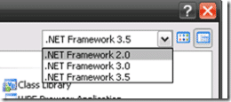
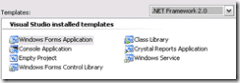

I have been tinkering with VS2008 for a week now, but I had not had time to really look at it.

They have made the interface slicker, and faster making the whole experience a little nicer.

{ .post-img }

When you go to create new projects you get a number of nice options that allow you to target multiple versions of the .NET Framework with a single IDE. This will be of real advantage to those companies that still want to use .NET 2.0 while still evaluating 3.0 and 3.5.

{ .post-img }

It should come as no surprise though that you will need to upgrade any existing projects to the new solution and project specifications in VS2008 so unfortunately you will no longer be able to open your projects in VS2005 after the upgrade has completed.

If you use Team System, you should baseline your projects first as the upgrade process disconnects you from source control and you can't reconnect it. Hopefully this will be fixed for the RTM, but it could well be something we will need to live with for the change over.

As you switch between the framework options the list of possible projects changes and you can see what has been added, but not the updates to functionality.

  
{ .post-img }

The screen shots above gives you an idea of what will be available for the different frameworks for Windows.

In the [Windows Communication Foundation](http://wcf.netfx3.com "Windows Communication Foundation") section though I got a pleasant surprise as they have added some workflow options to the list of services you can have. I assume that these are nice shortcuts to have, but that you could produce the same thing manually.

{ .post-img }

The addition of the Syndication Service Library is a nice touch though.

One of the things to watch is that even if you cerate an application that targets .NET 2.0 and add a Setup project to the mix, you will need to manually change the prerequisites from .NET 3.5 to .NET 2.0 yourself as .NET 3.5 is the default.

{ .post-img }

This is only mildly annoying as the .NET Framework 3.5 installer will automatically install .NET 2.0 if it is not there already. Once VS2008 is in RTM I think I would leave it set to the default, that was there is only one big install and you know that when you start using .NET 3.5 features you will only have a small install to go.

If you are connecting to a Team Foundation Server you will still need to install the "Team Explorer" client as it is not included. Personally I think it should be included in all versions of Visual Studio as standard, but I think it is likely that we will continue to be required to install it separately.

One of the really nice features in VS2008 the the ability to debug and step through JavaScript! I think I just heard your jaw hitting the floor! That's right, you can debug JavaScript. Oh for this feature 5 years ago...

Technorati Tags: [.NET](http://technorati.com/tags/.NET) [ALM](http://technorati.com/tags/ALM) [VS 2008](http://technorati.com/tags/VS+2008) [TFS](http://technorati.com/tags/TFS) [VS 2005](http://technorati.com/tags/VS+2005)
