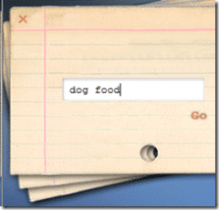
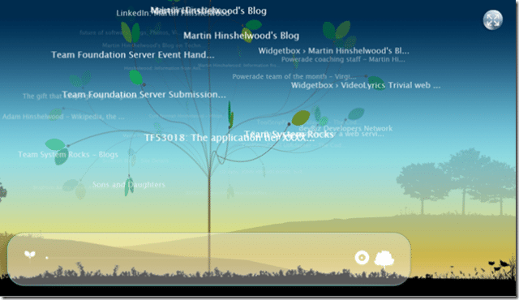

I just had to pick my jaw up off the floor. What made me gawk! [Tafiti](http://www.tafiti.com/) that's what.

{ .post-img }

Tafiti is a new search front end from Microsoft, it is still in beta, but what a beta. I think you would need a reasonably good computer to run it, but from a dyslexic persons point of view it is revolutionary. Although it does not give you the complete ability to search visually, it goes a long way to achieving it. Hopefully many other people will find it as equally usefully as I do...

What do I like so much about it you may ask... Well...

{ .post-img }

I love the way you can select what type of data to view from the search, there is a little spinning widget at the bottom left of the screen that you can use to view only feeds or web among other things. It is easy to use and extremely obvious what each button does (I think some hallway usability testing went on here).

{ .post-img }

I love the way you can pile up search terms on top of each other and then get back to your previous search with ease.  Although it could do with a way to flip between them...There is a way to filter your searches even further to tweak the results.

{ .post-img }

I love the way that you can save searches in your never ending search for what you are looking for. You can even add labels, although I have not worked out what they are for yet, but I am sure that it will be cool.

All that in itself would be good, but the best is yet to come. This is the bit that makes this a must use for all dyslexic people all over the world (well in English speaking countries so far).

{ .post-img }

The screen shot does not really do it justice, but this is an fantastic way to search the web. I have been doing some searching and, so far, I have been able to find exactly what I was looking for very quickly. Even obscure things we easy to find. This gets the thumbs up from a Scottish dyslexic software developer, and I can't wait to email the link to everyone. I have to thank [Larry Larsen](http://on10.net/Blogs/larry/first-look-microsoft-tafiti/) for pointing this out to me, and I hope the [Tafiti](http://www.tafiti.com/) team have even more cool search help up their sleeves.

I will be keeping my eye on this and I hope that even after continued use I am still using it as my main search engine: Oh, I just thought, we have Virtual Workstations in the office and I will need to see if it even works on them: I know that video, flash and big Powerpoint presentations do not.

Technorati Tags: [Dyslexia](http://technorati.com/tags/Dyslexia) [Live](http://technorati.com/tags/Live) [Answers](http://technorati.com/tags/Answers)
