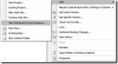
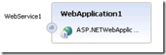
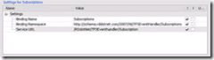
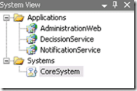

I have decided to have a little go at creating a Team Foundation Server Event Handler in .NET 3.5 that is resilient and scaleable. I will be using as many of the features of Team Suit as I can, but bear with me as there are a few things that are new to me. I am going to create everything under source control in CodePlex.

**TFS Event Handler in .NET 3.5 Articles**

1. [TFS Event Handler in .NET 3.5 Part 1 - The Architecture](http://blog.hinshelwood.com/archive/2007/08/21/TFS-Event-Handler-in-NET-3-5-Part-1-The-Architecture.aspx)
2. [TFS Event Handler in .NET 3.5 Part 2 - Handling Team Foundation Server Events](http://blog.hinshelwood.com/archive/2007/09/07/TFS-Event-Handler-in-NET-3-5-Part-2-Handling-Team-Foundation-Server-Events.aspx)
3. TFS Event Handler in .NET 3.5 Part 3 - Passing the events over a Windows Communication Foundation MSMQ (Coming soon)
4. TFS Event Handler in .NET 3.5 Part 4 - Workflow (Coming soon)

# The Architecture

The first toy I am going to play with is the Team Edition for Architecture components of Team Suit. This will hopefully allow me to create a system that has a bit of foresight and planning associated with it. I have played with these features before, but I have not, up until now, used them in battle.

I have created a blank solution in my TFS Event Handler Codeplex project, so it is time to create the "Distributed System Diagram" that I will use to define the architecture of the system.

 When you create the diagrams they are added to the Solution and not a specific project. These diagrams will be linked to the code that we will eventually create allowing us to view these diagrams even if we have made changes. They will update automatically with any  architectural changes that I have made after coding had started.
{ .post-img }

{ .post-img }

The logical place to start is with the Application Diagram, and this is highlighted by default. The other diagrams are usefully as well. The Logical Datacenter diagram will allow you to assign parts of the application to different servers and control the communication between these servers. The System Diagram is used to define logical systems that communicate with each other.

{ .post-img }

You get a number of diagrammatic options in the toolbox. The Applications section list all of the types of applications that are going to be in your solution and represents the projects that are going to be created under your solution. If you add a Windows Application for example, you will get a windows application project within your Visual Studio solution. It is worth noting that there is no need to think about "individual projects like what assemblies am I going to need", or "how will I arrange my namespaces" at this point. All we are interested is the main building blocks of the application.

## Application Diagram

The first application that I know that I am going to need are Web Service applications to handle the incoming events from Team Foundation Server and a web service that will allow us to configure any options for this part of the system and the subscriptions to team servers.

{ .post-img }

Now that I have added a web service you can see that it is just a different type of Web Application. This will need some configuring to be what we want. I have chosen to only handle two of the events that TFS throws, WorkItemChangedEvent and CheckInEvent. There are many other events that could be handled, but these two are probably the most common.

 
{ .post-img }

The completed service looks quite simple, but we now need to configure it to allow it to work effectively. If you leave everything as defaults you end up having a hundred things to change later, so it is way better to get it out of the way and polish it at this stage.  There are different setting available for each application and endpoint type, so the best thing to do is to look though all of the options and se what is what. You can see from the image right that I have configures all of the options on the service end \[point and I repeated this on all of the endpoints. Many of these setting are used when we generate the code at the end of this process.

The second application is the decision service. It has a MSMQ service endpoint called EventReciever that the notification service passes all of the events that it has received to. This service will then execute all of the events against the Workflow service that will perform any activities associated with the event. The reason for the EventReciever service is to make the system more robust. Because the EventReciever is a MSMQ service the Notification Service can still send messages to it even when it is down.

{ .post-img }

The final end point to add is a web based administration system for the workflow system. I have added all of the links between the applications that define the communication between the services. The ability to create these diagrams is not limited to being done at the start of the process, you can add this diagram to any solution and it will have all of your applications and links defined already. This is because there is a direct link between the solution and the diagrams. You can change either and affect both with the change, and this does not just apply to these architecture diagrams but to the Class diagrams that are part of Team Edition for Development.

{ .post-img }

With the application diagram done, I can now do an number of things. One of which is to "implement All Application" which will build my main projects for me.

What I am going to do first is take you though the "Define Deployment" and "Design Application System" options to get a better understanding of the capabilities of the system. Before I can do this, I will need to create a Logical Datacenter diagram to define what infrastructure is available, namely a single server that may or may not be the same server that Team Foundation Server is installed on.

{ .post-img }

In creating the Logical Datacenter I realized that I had made a mistake in my diagram of the system and I had not allowed for the additional web interfaces for the application. I have updated the diagram to reflect the problems I encountered. The diagram now has a separate web administration application that talks to both of the main admin services to get information and to make changes to the way that the system operates.

It has two web end points, one for administering the workflow in the event handler and the other for administering the subscriptions for the notification service.

This is one of the best advertisements for this way of working as you spot more of the mistakes at this point and not half way through coding.

## Logical Datacenter Diagram

{ .post-img }

The logical datacenter diagram is very simple for this application as I want it to run initially in a single server environment. At the moment I have no need for a database, but it can easily be added to the system at a later date, I could even separate out the services from the website without having to change much of anything as far as the developers are concerned, it just impacts the architects.

{ .post-img }

The options that you get are mainly self explanatory, you can add "Zones" which are your firewall areas and put your servers with these areas. You can then add endpoints and their links through the firewalls to show how communication occurs. You can add all of your firewall rules into the system so it more readily replicated your network.

For this application I only have one zone and one line of communication as all other communication takes place on the server.

You could have a much more complicated infrastructure, but for this application it is unnecessary.

## Deployment Diagram

  
{ .post-img }

The deployment diagram allows you to place all of you applications onto the diagram so you can define the  communication lines and determine wither the applications can talk to each other in the desired way.

In this case we only have one Zone and one server with HTTP inbound for the web sites. You can see from the diagram that I have added all of the applications to the one server.

## System Diagram

 
{ .post-img }

If you have a complicated system with more than a few applications you will want to brake up the diagram into manageable Systems that you can see the input and output of the system. You could say that there is a Core system that contains the web services and that only two of the web services are accessible outside of the system. If you add the applications to a System diagram and right click on a web services you get the option to create a "Proxy endpoint" that sites at the edge of the system but is linked to the main service.

I can now create a From End System diagram that has the website and only a definition of the Core system without any of the internal components.

{ .post-img }

You can see the result in the diagram to the left. In much larger system it allow your to view the components and the interaction of the components from a variety of differing angles to see how the whole thing interacts.

## Implementation

{ .post-img }

The last part of this is to initiate the implementation of all the application that I have created. This will create the projects under a solution that can then be used to build the final application.

{ .post-img }

As you an see, without doing any code or creating any projects within VS manually I have a full solution. That is my job as the architect over, unless there are any changes from development. This would not be handed over to the developers for completion.

NOTE: I have found that using this method you can only create ASMX services, and not WCF. This will hopfully (PLEASE) be sorted for RTM of Visual Studio 2008.

Technorati Tags: [Visual Studio Team System](http://technorati.com/tags/Visual%20Studio%20Team%20System), [Visual Studio 2008](http://technorati.com/tags/Visual%20Studio%202008), [Team Edition for Architects](http://technorati.com/tags/Team%20Edition%20for%20Architects), [TFSEventHandler](http://technorati.com/tags/TFSEventHandler), [Microsoft .NET Framework](http://technorati.com/tags/Microsoft%20.NET%20Framework), [Software Industrial Revolution](http://technorati.com/tags/Software%20Industrial%20Revolution)
