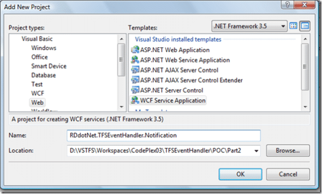

I have decided to have a little go at creating a Team Foundation Server Event Handler in .NET 3.5 that is resilient and scaleable. I will be using as many of the features of Team Suit as I can, but bear with me as there are a few things that are new to me.

**[TFS](http://msdn2.microsoft.com/en-us/teamsystem/aa718934.aspx "Team Foundation Server") Event Handler in .NET 3.5 Articles**

1. [TFS Event Handler in .NET 3.5 Part 1 - The Architecture](http://www.multidimensionalfreethinking.co.uk/archive/2007/08/21/TFS-Event-Handler-in-NET-3-5-Part-1-The-Architecture.aspx)[](http://www.multidimensionalfreethinking.co.uk/archive/2007/08/21/TFS-Event-Handler-in-NET-3-5-Part-1-The-Architecture.aspx)
2. [TFS Event Handler in .NET 3.5 Part 2 - Handling Team Foundation Server Events](http://www.multidimensionalfreethinking.co.uk/archive/2007/09/07/TFS-Event-Handler-in-NET-3-5-Part-2-Handling-Team-Foundation-Server-Events.aspx)
3. TFS Event Handler in .NET 3.5 Part 3 - Passing the events over a Windows Communication Foundation MSMQ (Coming soon)
4. TFS Event Handler in .NET 3.5 Part 4 - Workflow (Coming soon)

# Handling Team Foundation Server Events

Because of the lack of support for [Windows Communication Foundation](http://wcf.netfx3.com "Windows Communication Foundation") in the Team Edition for Architects I will be replacing all of the auto-generated services with [Windows Communication Foundation](http://wcf.netfx3.com "Windows Communication Foundation") services. But as it turns out this messes up everything, so I have started from scratch and I will post all of the code for doing this without the Architect bit.

The first thing that you need is the Contract for Team Foundation Server event handling. This is very specific and only works if used accurately:

> ```
> Imports System.ServiceModel
> Imports System.Runtime.Serialization
> Imports Microsoft.TeamFoundation.Server
>
>     ''' <summary>
>     ''' This is the service contract for integrating with the Team Foundation Server notification events.
>     ''' </summary>
>     ''' <remarks></remarks>
>     <ServiceContract(Namespace:="http://schemas.microsoft.com/TeamFoundation/2005/06/Services/Notification/03")> _
>     Public Interface INotification
>
>         ''' <summary>
>         ''' The Notify method if fired whenever a subscribed event arrives.
>         ''' </summary>
>         ''' <param name="eventXml">This XML defines the data that was changed on the event.</param>
>         ''' <param name="tfsIdentityXml">This XML identifies the Team Foundation Server the event came from.</param>
>         ''' <param name="SubscriptionInfo">Information about the subscriber</param>
>         ''' <remarks></remarks>
>         <OperationContract( _
>                         Action:="http://schemas.microsoft.com/TeamFoundation/2005/06/Services/Notification/03/Notify", _
>                         ReplyAction:="*" _
>                         )> _
>         <XmlSerializerFormat( _
>                         Style:=OperationFormatStyle.Document _
>                         )> _
>         Sub Notify(ByVal eventXml As String, ByVal tfsIdentityXml As String, ByVal SubscriptionInfo As SubscriptionInfo)
>
>     End Interface
> ```

This code allows you to capture TFS events and we will be using by reference only. If you have been having trouble handling the events then look know further than here for [Windows Communication Foundation](http://wcf.netfx3.com "Windows Communication Foundation") as this has been tried and tested.

The real trick for handling TFS events in [Windows Communication Foundation](http://wcf.netfx3.com "Windows Communication Foundation") is that all the events come into the same routine. It would be nice if SubscriptionInfo listed what event it was, but alas it does not. So you may be thinking that you need to parse the XML and find out what type of event it is. Well you can if you want, but I find it easer to have more than one endpoint for the same service. You can then parse the URL for the event type, which is way easier than the XML as the events are all different.

The first thing you need to do is create a project to hold the code. In the spirit of expedition, I have created a "[Windows Communication Foundation](http://wcf.netfx3.com "Windows Communication Foundation") Service Application" to hold all of the Notification service code. But in the real world you would keep the Contract and Implementation classes in different assemblies.

[](http://blog.hinshelwood.com/files/2011/06/GWB-WindowsLiveWriter-TFS.5Part2HandlingTeamFoundationServerEv_1464E-image.png)
{ .post-img }

Now we have the project, you can add the INotification class and the Notification service. I like to keep all of my services in a "v1.0" so that I can add other services in new versions without affecting the current version.

[](http://blog.hinshelwood.com/files/2011/06/GWB-WindowsLiveWriter-TFS.5Part2HandlingTeamFoundationServerEv_1464E-image_1.png)
{ .post-img }

Once you have your INotification class looking like the code extract above we will add a default implementation and test the service. The default implementation should look like:

> ```
> Imports Microsoft.TeamFoundation.Server
>
> Public Class Notification
>     Implements INotification
>
>     Public Sub Notify(ByVal eventXml As String, ByVal tfsIdentityXml As String, ByVal SubscriptionInfo As SubscriptionInfo) Implements INotification.Notify
>
>     End Sub
>
> End Class
>
> ```

[](http://11011.net/software/vspaste)

This class just implements the INotification contract (interface) and has an empty Sub for the notify method that will be called when an event is fired in TFS.

[](http://11011.net/software/vspaste)

The config file will contain a definition of the service as well as two endpoints for the same interface. The services and behaviours occur within the <system.serviceModel\> tags.

> ```
> <system.serviceModel>
>   <services>
>    ...
>   </services>
>   <behaviors>
>    ...
>   </behaviors>
> </system.serviceModel>
> ```

[](http://11011.net/software/vspaste)[](http://11011.net/software/vspaste)[](http://11011.net/software/vspaste)[](http://11011.net/software/vspaste)

This is the really important part of getting the service working, and goes between the <services\> tags. The first part of the service configuration contains the service definition. Here we define the name of the service, which should be the same as full namespace and class name of out implementation, the behavior configuration name (we will look at this is a bit) and the endpoints.

> ```
> <service behaviorConfiguration="NotificationServiceBehavior" name="RDdotNet.TFSEventHandler.NotificationHost.Notification">
>     <endpoint address="WorkItemChangedEvent" binding="wsHttpBinding" contract="RDdotNet.TFSEventHandler.NotificationHost.INotification"/>
>     <endpoint address="CheckInEvent" binding="wsHttpBinding" contract="RDdotNet.TFSEventHandler.NotificationHost.INotification"/>
>     <endpoint address="mex" binding="mexHttpBinding" contract="IMetadataExchange"/>
> </service>
> ```
>
> [](http://11011.net/software/vspaste)

In a service hosted within IIS there is no need to set a base address as the location of the .svc file sets this for us. In this case it is [http://localhost:\[port\]/v1.0/Notification.svc](http://localhost:[port]/v1.0/Notification.svc). The "mex" endpoint allows other application to discover the capabilities of the service.

The other two endpoint point at the same contract and are in fact implemented by the same method in the service implementation. These two endpoints have different addressed so that we can tell team server to send events to different URL's but use the same code to process the events. You could add any of the TFS events in to this list of end points, but it is best to keep the names the same as the event being fired as we will detect it later. We are using the wsHttpBinding as the most advanced that TFS will support.

[](http://11011.net/software/vspaste)

You only need to set two options on the service behavior, the httpGetEnabled needs to be set to true for the WSDL and the meta data to work. This allows the discoverability of you services. The includeExceptionDetailInFaults option allows the diagnosis of faults when we test the service.

> ```
> <serviceBehaviors>
>     <behavior name="NotificationServiceBehavior">
>         <serviceMetadata httpGetEnabled="true"/>
>         <serviceDebug includeExceptionDetailInFaults="true"/>
>     </behavior>
> </serviceBehaviors>
> ```

The service behaviors go between the <behaviors\> tags and are named the same as the services behaviorConfiguration attribute.

We now have a working service and can test it by starting a new instance of the web application and going to the URL of the .svc file. You will see a page like:

[](http://blog.hinshelwood.com/files/2011/06/GWB-WindowsLiveWriter-TFS.5Part2HandlingTeamFoundationServerEv_1464E-image_2.png)
{ .post-img }

This shows you how you can connect to the service, but as this will only be connected to by TFS it is not a requirement for just now. What is important is to see the URL's for the two endpoints that we have created. If you click the WSDL URL ("[http://localhost:65469/v1.0/Notification.svc?wsdl](http://localhost:65469/v1.0/Notification.svc?wsdl)") you will see the generated meta data for the service.

I am not going to display the full WSDL here as it is huge, but here is the important section for what we need to look at:

> ```
> <wsdl:service name="Notification">
>   <wsdl:port name="WSHttpBinding_INotification" binding="tns:WSHttpBinding_INotification">
>     <soap12:address location="http://localhost:65469/v1.0/Notification.svc/WorkItemChangedEvent"/>
>     <wsa10:EndpointReference>
>       <wsa10:Address>http://localhost:65469/v1.0/Notification.svc/WorkItemChanged</wsa10:Address>
>       <Identity xmlns="http://schemas.xmlsoap.org/ws/2006/02/addressingidentity">
>         <Upn>comuter1user1</Upn>
>       </Identity>
>     </wsa10:EndpointReference>
>   </wsdl:port>
>   <wsdl:port name="WSHttpBinding_INotification1" binding="tns:WSHttpBinding_INotification">
>     <soap12:address location="http://localhost:65469/v1.0/Notification.svc/CheckInEvent"/>
>     <wsa10:EndpointReference>
>       <wsa10:Address>http://localhost:65469/v1.0/Notification.svc/CheckIn</wsa10:Address>
>       <Identity xmlns="http://schemas.xmlsoap.org/ws/2006/02/addressingidentity">
>         <Upn>computer1user1</Upn>
>       </Identity>
>     </wsa10:EndpointReference>
>   </wsdl:port>
> </wsdl:service>
> ```

This section of the WSDL highlights the service definition and the two endpoints that exist. We are now able to get TFS to send events to this service. To do this you need to add the URL's of the end points to the notification system within TFS. This is done by using a command line utility on the server, or by calling parts of the TFS API. For ease we will call the command line, but a future version should probably have a user interface to allow the administration of which TFS servers you want to handle events for.

To subscribe to the events you will need to use the BisSubscribe utility which you can find out how to use [here](http://olausson.net/blog/PermaLink,guid,d9948138-262e-4db0-94f1-4f0a033b0fb0.aspx), or you can use the API and provide an interface to add and remove subscriptions.

If you call:

> BisSubscribe.exe /userId **TFSEventHandler** /eventType **WorkItemChangedEvent** /deliveryType **Soap** /address http://localhost:65469/v1.0/Notification.svc/WorkItemChanged

Using the untility you will subscribe to events using SOAP, or if you call:

> ```
> SubscribeEvent(tfsServer, "TFSEventHandler", "http://localhost:65469/v1.0/Notification.svc/WorkItemChangedEvent", DeliveryType.Soap, Schedule.Imediate, EventType.WorkItemChangedEvent)
> ```
>
> [](http://11011.net/software/vspaste)

Using a API helper class similar to the one below:

> ```
>     ''' <summary>
>     ''' Helper methods for subscribing to and from events
>     ''' </summary>
>     ''' <remarks></remarks>
>     Public Class SubscriptionHelper
>
>         Public Shared Function SubscribeEvent(ByRef tfs As TeamFoundationServer, ByVal userName As String, ByVal deliveryAddress As String, ByVal Type As Microsoft.TeamFoundation.Server.DeliveryType, ByVal Schedule As Microsoft.TeamFoundation.Server.DeliverySchedule, ByVal EventType As EventTypes, Optional ByVal Filter As String = "") As Integer
>             Dim eventService As IEventService = CType(tfs.GetService(GetType(IEventService)), IEventService)
>             Dim delivery As DeliveryPreference = New DeliveryPreference()
>             delivery.Type = Type
>             delivery.Schedule = Schedule
>             delivery.Address = deliveryAddress
>             Return eventService.SubscribeEvent(userName, EventType.ToString, Filter, delivery)
>         End Function
>
>         Public Shared Sub UnSubscribeEvent(ByRef tfs As TeamFoundationServer, ByVal subscriptionId As Integer)
>             Dim eventService As IEventService = CType(tfs.GetService(GetType(IEventService)), IEventService)
>             eventService.UnsubscribeEvent(subscriptionId)
>         End Sub
>
>     End Class
> ```

I may write an article in the future on this, but all the code is part of the current [TFSEventHandler](http://tfseventhandler.codeplex.multidimensionalfreethinking.co.uk) application.

We now want to determine what sort of event has been raised in the Service implementation. To do this we need to parse the URL of the endpoint that has been raised and retrieve the event type.

> ```
> Dim UriString As String = OperationContext.Current.EndpointDispatcher.EndpointAddress.Uri.AbsoluteUri
> Dim SlashIndex As Integer = UriString.LastIndexOf("/")
> Dim EndieBit As String = UriString.Substring(SlashIndex, (UriString.Length - (UriString.Length - SlashIndex)))
> Dim EventType As EventTypes = CType([Enum].Parse(GetType(EventTypes), EndieBit), EventTypes)
> ```
>
> [](http://11011.net/software/vspaste)

As you can see it is just a case of parsing the URL to get the last bit after the final "/" and then converting it to an enumerator.

> ```
> Public Enum EventTypes
>     Unknown = 0
>     AclChangedEvent
>     Branchmovedevent
>     BuildCompletionEvent
>     BuildStatusChangeEvent
>     CommonStructureChangedEvent
>     DataChangedEvent
>     IdentityChangedEvent
>     IdentityCreatedEvent
>     IdentityDeletedEvent
>     MembershipChangedEvent
>     WorkItemChangedEvent
>     CheckinEvent
> End Enum
> ```

[](http://11011.net/software/vspaste)The enumerator lists all of the events that are possible in TFS, but be warned that not all of the events fire effectively. Once you have the event it can be converted into an object. I use code from [Howard van Rooijen's TFS Project Template](http://blogs.conchango.com/howardvanrooijen/archive/2006/04/29/3894.aspx "Howard van Rooijen's TFS Project Template") for the event objects and [Larry Steinle's CustomXmlSerializer](http://www.codeproject.com/useritems/CustomXmlSerializer.asp) code to convert the XML to Howard's objects resulting in the following code:

> ```
> Dim IdentityObject As TFSIdentity = EndpointBase.CreateInstance(Of TFSIdentity)(tfsIdentityXml)
> Dim EventObject As WorkItemChangedEvent = EndpointBase.CreateInstance(Of WorkItemChangedEvent)(eventXml)
> ```
>
> [](http://11011.net/software/vspaste)

All of the objects are now ready to pass over MSMQ to the TFS Event Processor, which will be the subject of the next article in this series...

Technorati Tags: [Visual Studio Team System](http://technorati.com/tags/Visual%20Studio%20Team%20System), [Visual Studio 2008](http://technorati.com/tags/Visual%20Studio%202008), [Team Edition for Architects](http://technorati.com/tags/Team%20Edition%20for%20Architects), [TFSEventHandler](http://technorati.com/tags/TFSEventHandler), [Microsoft .NET Framework](http://technorati.com/tags/Microsoft%20.NET%20Framework), [Software Industrial Revolution](http://technorati.com/tags/Software%20Industrial%20Revolution), [WCF](http://technorati.com/tags/WCF), [TFS Event Handler](http://technorati.com/tags/TFS%20Event%20Handler)
