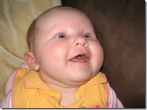

My wife, Jadie Hinshelwood, has just started [blogging](http://jadie.hinshelwood.com/2007/09/story-so-far.html) about our journey to get pregnant, miscarriage via [A Yummy Mummy is Born](http://jadie.hinshelwood.com), I hope you will give her some support.

{ .post-img }

It was a hard and long journey, but we [got there in the end](http://jadie.hinshelwood.com/2007/09/and-so-there-were-3.html "Goit there in the end") :)

{ .post-img }

Technorati Tags: [Personal](http://technorati.com/tags/Personal)
