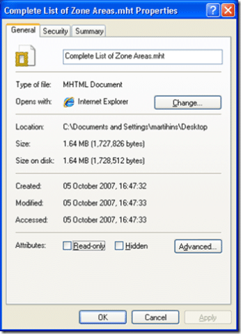

I know a couple of people who have been complaining that Experts Exchange was getting rather slow, and I had noticed the same. So I thought I would investigate how big the pages really are.

The first test is to save the page "Complete List of Zone Areas.mht" and see how big/ or small it is...Well my jaw hit the floor and here is why:

 
{ .post-img }

What are those guys at Experts Exchange thinking! I know we all have broadband, but this is ridiculous... I am on my corporate network and it is soooo slooow. It is slow from home as well, and that's a 20Mb Cable line...

Even when you download it as a .htm file it is more than 1.2mb and its mainly the HTML :o And it still locks up IE7 on my Intel duo, 2gb laptop when viewing the page from my HDD.

The main reason that I am writing this here instead of sending them feedback is I don't have the time to so:

[http://www.experts-exchange.com](http://www.experts-exchange.com)

pause - 15 seconds

Scroll - coz I only get the header on my windscreen display

pause - 30 seconds

Scroll more - coz the page is really big

pause - 28 seconds

click link- coz I only get the header on my windscreen display

pause - 15 seconds

...sod it, I'm board...

Click 
{ .post-img }

Technorati Tags: [Fail](http://technorati.com/tags/Fail)

