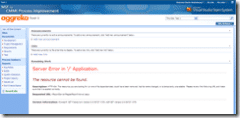
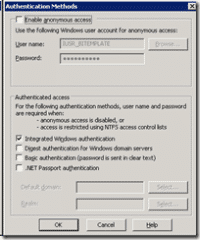
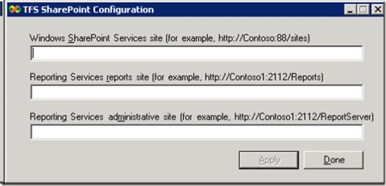

Well, setting up TFS 2008 is pretty easy. I have done an upgrade before, but I have now deployed my first pure TFS 2008 server to a clean environment. I have Reporting Services, SQL and TFS on one box and SharePoint 2007 in my Farm. Word of warning:

> **_RTFM_**

The first thing I did after a successfully install of TFS was make sure that I could create my first project "Test 1". This is essential to determine that everything is working and should be done on the server to prevent any other issues getting in the way.

 
{ .post-img }

The only problem I had was getting the reporting working. The first issue was authentication. When I checked the "Default Website" config it was set to anonymous only, so I changed that to "Integrated Windows" and that solved the authentication issues.

{ .post-img }

The second problem was that I changed the reporting server URL, again to the friendly one and it broke SharePoint. I have a SharePoint 2007 Farm where all the TFS portals will be deployed. Even though I ran "TfsConfigWss.exe" located in the Tools folder on the SharePoint server after installing the SharePoint TFS component I still needed to run a register hack to get it to work. The key is under the Local Machine @SoftwareMicrosoftVisualStudio9.0TeamFoundationReportServer and you get a key for each of your SharePoint managed paths.

{ .post-img }

What TFS does now does that is very nice is that you can have multiple TFS servers deploying to the same SharePoint farm. So I created a Managed Path of "TFS01" (my first TFS server at Aggreko, Awww) and pointed TFS at it.

I then changed the name of the server to a friendly name. This is no longer the [nasty mess it once was](http://blog.hinshelwood.com/archive/2007/05/31/Team-Foundation-Server-amp-SharePoint-3.0.aspx): The TfsAdminUtil.exe now has functionality to change all of the URLs for TFS, SharePoint and RS, so that was easy.

But I still have the old issue of not being able to authenticate when I am on the server once I have changed the "name" of TFS from the server name (default) to a friendly URL.

This is no problem as that was how it worked in my previous environment. I think it is a proxy server issue, but I am not sure. Not much of a problem though...

Technorati Tags: [SP 2007](http://technorati.com/tags/SP+2007) [ALM](http://technorati.com/tags/ALM) [TFS 2008](http://technorati.com/tags/TFS+2008)
