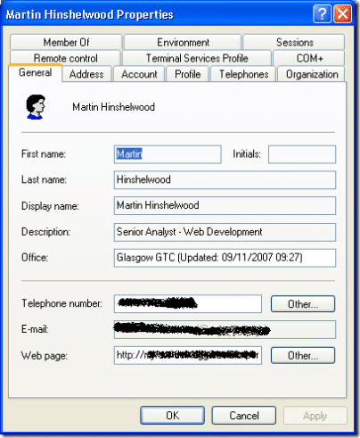
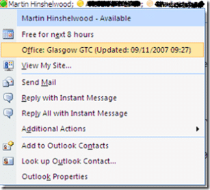

I decided that I should have a go at this LINQ thing, so as .NET 3.5 will be RTM at the end of the month I am using LINQ and .NET 3.5 in my new Locator project.

The Locator project is just a small application that will run on a users computer and tell a central server where they are. In Aggreko we have the problem that people are moving about a lot (everyone has a laptop) and when you are looking for someone you need to be able to find them.

[](http://blog.hinshelwood.com/files/2011/05/GWB-WindowsLiveWriter-WhereamI_97C1-WhereAmI_Infrastructuer.gif)
{ .post-img }

The application sits and poles the IP address of the local computer, and when it get an internal IP (i.e. not localhost) it will send that IP to a [Windows Communication Foundation](http://wcf.netfx3.com "Windows Communication Foundation") service for identification. If it is an IP that represents an internal company IP it sends back the detected location to the client and stores it in a database. The client then updates the physicalDeliveryOfficeName property in Active Directory and notifies the user of their location.

[](http://blog.hinshelwood.com/files/2011/05/GWB-WindowsLiveWriter-WhereamI_97C1-image_1.png)
{ .post-img }

The information updated into Active Directory will then be visible on SharePoint and in any presence display.

[](http://blog.hinshelwood.com/files/2011/05/GWB-WindowsLiveWriter-WhereamI_97C1-image.png) [](http://blog.hinshelwood.com/files/2011/05/GWB-WindowsLiveWriter-WhereamI_97C1-image_2.png)
{ .post-img }

As you can see the SharePoint listing is considerably out of date. This is because of the Schedule associated with its import of profiles. it does not seam as if it can be done any more regularly than once a day 
{ .post-img }

The LINQ comes to the forefront when I am updating the database from the service. LINQ made this incredibly easy, but produced some strange looking SQL.

> ```
>  ' Get single value. This will execute the SQL
>             Dim wai_Uip = (From val_uip In DataStore.WhereAmI_UserIPs _
>                           Join val_ipm In DataStore.WhereAmI_IPMasks _
>                             On val_uip.CurrentIP.Substring(0, val_uip.CurrentIP.LastIndexOf(".")) _
>                             Equals val_ipm.Data.Substring(0, val_ipm.Data.LastIndexOf(".")) _
>                           Join val_off In DataStore.WhereAmI_Offices _
>                             On val_ipm.OfficeID _
>                             Equals val_off.OfficeID _
>                           Where val_uip.UserID = user _
>                           Select val_off.Country, val_off.Name, val_ipm.Data).First
> ```

[](http://11011.net/software/vspaste)

Which produces this crazy SQL:

> ```
> SELECT [t2].[Country], [t2].[Name], [t1].[Data]
> FROM [dbo].[WhereAmI_UserIP] AS [t0]
> INNER JOIN [dbo].[WhereAmI_IPMask] AS [t1] ON SUBSTRING([t0].[CurrentIP], @p0 + 1,
>     (CASE
>         WHEN (CONVERT(Int,DATALENGTH(@p1) / 2)) = 0 THEN (CONVERT(Int,DATALENGTH([t0].[CurrentIP]) / 2)) - 1
>         WHEN CHARINDEX(@p1, [t0].[CurrentIP]) = 0 THEN -1
>         ELSE 1 + ((CONVERT(Int,DATALENGTH([t0].[CurrentIP]) / 2)) - ((CONVERT(Int,DATALENGTH(@p1) / 2)) + CHARINDEX(REVERSE(@p1), REVERSE([t0].[CurrentIP]))))
>      END)) = SUBSTRING([t1].[Data], @p2 + 1,
>     (CASE
>         WHEN (CONVERT(Int,DATALENGTH(@p3) / 2)) = 0 THEN (CONVERT(Int,DATALENGTH([t1].[Data]) / 2)) - 1
>         WHEN CHARINDEX(@p3, [t1].[Data]) = 0 THEN -1
>         ELSE 1 + ((CONVERT(Int,DATALENGTH([t1].[Data]) / 2)) - ((CONVERT(Int,DATALENGTH(@p3) / 2)) + CHARINDEX(REVERSE(@p3), REVERSE([t1].[Data]))))
>      END))
> INNER JOIN [dbo].[WhereAmI_Office] AS [t2] ON [t1].[OfficeID] = [t2].[OfficeID]
> WHERE [t0].[UserID] = @p4',N'@p0 int,@p1 nvarchar(1),@p2 int,@p3 nvarchar(1),@p4 nvarchar(20)
> ```
>
> [](http://11011.net/software/vspaste)

Now that is nuts 
{ .post-img }

Technorati Tags: [.NET](http://technorati.com/tags/.NET) [WCF](http://technorati.com/tags/WCF)

