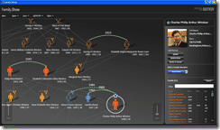

 Something occured to me after seeing the [Family Show](http://www.vertigo.com/familyshow.aspx) application from [Vertigo](http://www.vertigo.com). If you have not seen this application it is definitely worth a look. What I want to achieve would be to display and allow the edit of company Higherarchical data through a similar interface to the one presented in Family Show.
{ .post-img }

{ .post-img }

The data would be centric around an employee, with data for Management, organisational and cost higherarchies. It would allow users to edit selected information about their subordinates and to create fictional reorganisations of the company. Users would be able to edit their own data and search for any user, group or organisational unit.

The data would be fed into a database after workflow on authorising the updates has been completed and would them make its way into all the other systems within the organisation including HR system, Active Directory and SharePoint.

 So just a small task then...
{ .post-img }

It should be possible to get the project off the ground by providing a single point of truth for information on staff. This in conjunction with technologies like SharePoint and Communication Server should provide substantial business benefit to companies  holding data about its staff in multiple systems geographically.

Technorati Tags: [Misc](http://technorati.com/tags/Misc)
