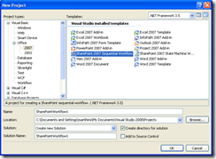

Better late than never, but I [attended](http://blog.hinshelwood.com/archive/2007/11/20/VS2008-Update.aspx) a [MSDN event](https://msevents.microsoft.com/cui/EventDetail.aspx?culture=en-GB&eventid=1032355353) on Tuesday night in Edinburgh. Although I eagerly signed up for it, I did not expect to learn a lot:

**Windows SharePoint 3.0** - [Martin Parry](http://www.martinparry.com/)

I am not usually a fan of Martin's speaking, but it seems that it might have been due to the content that I have heard him present in the past. maybe he just always got the short straw for the boring content at previous events I have attended, but this time I was presently surprised.

I found Martin's incite into SharePoint Services 2007 very informative and interesting and I learned the following key points about WSS3.0 that interested me:

- Office SharePoint Designer is for users

> _Although SharePoint designer is the "new" front page, it is definitely for "power" users of SharePoint. Its ability to make simple Workflow easy and to allow the user more control over many facets of the sites and lists is invaluable. Granted this is not the tool for all users. Most users are content to point and click within SharePoint itself, but when that is not enough (and when you need a new type of workflow it is not), this is the tool that they will turn to. It works very like all of the office products with a friendly users interface and a default tendency to hide the code that may frighten a less experienced power user._

- Not for relational things!

> _Martin pointed out that this is a mistake that many developers get into with SharePoint, and being one of those unfortunate developers who has tried to struggle with relational content, I agree with him that SharePoint does not handle it well. This is not a bad thing, just a limitation to be aware of. I have spent many hours trying to get a list in Site A to load content from another list in Site B, which is just not the way to do it..._

- SharePoint workflow with VS2008

> _The new SharePoint 2007 Workflow projects within Visual Studio 2008 look very impressive and beats the previous method in VS2005 hands down. You can find the new projects under the "Office" section of your chosen language in VS2008._
>
> [__](http://blog.hinshelwood.com/files/2011/05/GWB-WindowsLiveWriter-EventMSDNSharePointforDevelopers_F0A9-image_2.png)
> { .post-img }

**An introduction to MOSS 2007** - [David Gristwood](http://blogs.msdn.com/david_gristwood/)

This was the first time I had seen David perform on stage and I was quite impressed. He initially seams agitated, as he hops about on stage, but as the session unfolded it becomes just part of his presentation style. He gets very exited about the subjects he is talking about and can make even boring subjects seam interesting. Here are the cool things I found interesting:

- Enterprise search is very cool

> _This is something that I knew already, but it was good to see a demo implementation and even a quick look at Microsoft's own internal implementation of Search within an organisation._

- Search can search exchange and custom databases (BDC)

> _The ability to integrate BDC information into your search results, I think is invaluable. You could give users the ability to look up Customers or in our case Fleet units or products and link them all together. Very powerfully..._

- Use info path for forms

> _I had not really seen any info path implementation prior to this presentation, but I had played about with it and noted the lack of customisation and lack of direct integration inside of SharePoint. What David showed us however convinced me that if users need to fill out a form, it should be done in info path. It is a fantastic tool to add to the arsenal of SharePoint._

I found the whole thing very informative and I would recommend it to both novices and experts as it helped me fill in some of the blanks and gain incite into future improvements.

Technorati Tags: [SP 2007](http://technorati.com/tags/SP+2007) [MOSS](http://technorati.com/tags/MOSS) [VS 2008](http://technorati.com/tags/VS+2008) [SharePoint](http://technorati.com/tags/SharePoint) [VS 2005](http://technorati.com/tags/VS+2005)
