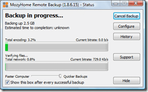
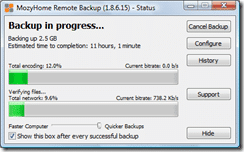

I was looking for an online backup solution and [Scott Hanselman](http://www.hanselman.com/blog/OnLosingDataAndAFamilyBackupStrategy.aspx) provided it for me: Thanks Scott and good luck with all the [new stuff](http://www.hanselman.com/blog/NewJobNewHouseNewBabyAndDesigningATotallyNewHomeOffice.aspx) :).

These days, with all of your...lets call it "stuff" being mostly digital. The photos of the kids, your correspondence, all your work... You need backup...

I have been looking for a solution that does not brake the bank, but the best I could find was "BT" who charge and arm and a leg while probably losing your data. If the government can lose 7 million peoples personal details (du..post? How dumb can you get!) then BT can lose your backup. With Mozy being a smaller company, all be it partnered with someone bigger, loosing your data could brake them, so it is in their interest to provide the best service rather than best-effort as you would get from BT or another monolithic company that really does not care about your data, just your money...

{ .post-img }

I have only just started using [Mozy Backup](https://mozy.com/?ref=8R96AG) but I think it is a winner. With 2GB of free space (which never does the job :)) it is a fantastic solution. And it is only $5 for unlimited space, Wow...

It has a really simple setup, even my dad could work it, and just chugs away in the background. You get options (pictured above) for wither you want quicker backups or a faster computer, but with 2.5GB of data to get through I opted for the faster backup.

And speaking of data size, did you notice that I don't have enough space for a full backup? Well if you sign up using this URL [https://mozy.com/?ref=8R96AG](https://mozy.com/?ref=8R96AG) you get an extra 250mb, and so do I :)

{ .post-img }

Only 11 hours to go till I have a full backup :)

Technorati Tags: [Personal](http://technorati.com/tags/Personal)
