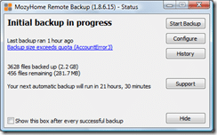

Well, I currently have two referrals :)

Thanks to [Garrett Hoofman](http://geekswithblogs.net/gambit_sunob/Default.aspx "Garrett Hoofman") and _[Andrew Stifora](http://stifora.com/)_ who got their fingers out and [got backed up](http://blog.hinshelwood.com/archive/2007/11/26/Mozy-Backup.aspx)! Hopefully the others that have signed up with my referral link will complete a backup as well so we can all benefit (well me!) from the extra space.

Go on get an [extra 250MB](https://mozy.com/?code=8R96AG) added to your 2GB of storage when you get [Mozy online backup](https://mozy.com/?code=8R96AG).

It seams that in order to clamed a referral bonus the referee needs to have completed at least one backup:

> #### _**Referrals**_
>
> <table cellspacing="0" cellpadding="2" width="400" border="0"><tbody><tr><td valign="top" width="133"><em>User</em></td><td valign="top" width="133"><em>Status</em></td><td valign="top" width="133"><em>Date</em></td></tr><tr><td valign="top" width="133"><em><a target="_blank" href="http://stifora.com/">Andrew Stifora</a></em><em></em></td><td valign="top" width="133"><em>Using Mozy</em></td><td valign="top" width="133"><em>11/26/07</em></td></tr><tr><td valign="top" width="133"><em><a title="Garrett Hoofman" target="_blank" href="http://geekswithblogs.net/gambit_sunob/Default.aspx">Garrett Hoofman</a></em></td><td valign="top" width="133"><em>Using Mozy</em></td><td valign="top" width="133"><em>11/26/07</em></td></tr><tr><td valign="top" width="133"><em>Giovanni P.</em></td><td valign="top" width="133"><em>Signed Up</em></td><td valign="top" width="133"><em>11/26/07</em></td></tr><tr><td valign="top" width="133"><em>Piotr</em></td><td valign="top" width="133"><em>Signed Up</em></td><td valign="top" width="133"><em>11/26/07</em></td></tr><tr><td valign="top" width="133"><em>M</em></td><td valign="top" width="133"><em>Signed Up</em></td><td valign="top" width="133"><em>11/27/07</em></td></tr><tr><td valign="top" width="133">Peter Benschop</td><td valign="top" width="133"><em>Signed Up</em></td><td valign="top" width="133"><em>11/27/07</em></td></tr></tbody></table>
>
> _Total space from referrals: 256 MB_
>
> _People with a status of "Signed Up" have not yet backed anything up. You will receive your free space when they complete a backup. (Please allow 24 hours for your extra space to show up.)_
>
> _Your referral URL:_ _[https://mozy.com/?code=8R96AG](https://mozy.com/?code=8R96AG)_

I thought I should "name and shame" those that have gone only half way :)  Get backing up!

{ .post-img }

I only need another 300MB...so...

...**_My quest for more free backup space continues..._**

Technorati Tags: [Personal](http://technorati.com/tags/Personal)
