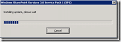
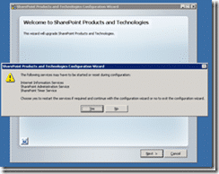
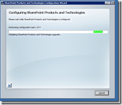
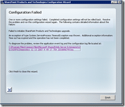

- wssv3sp1-kb936988-x86-fullfile-en-us.exe

[http://www.microsoft.com/downloads/details.aspx?FamilyId=4191A531-A2E9-45E4-B71E-5B0B17108BD2&displaylang=en#filelist](http://www.microsoft.com/downloads/details.aspx?FamilyId=4191A531-A2E9-45E4-B71E-5B0B17108BD2&displaylang=en#filelist "http://www.microsoft.com/downloads/details.aspx?FamilyId=4191A531-A2E9-45E4-B71E-5B0B17108BD2&displaylang=en#filelist")

{ .post-img }

Not realy installing updates, more like unpacking...

{ .post-img }

Ah, the usual fun... Good thin this is on a dev box otherwise I would need to be restarting services out of hours...or just tell my users it was a tempourary glitch 
{ .post-img }

{ .post-img }

Got loads of options, but no way to change them...typical service pack build of the base installer...Not a problem with me, familiar. Makes those production guys feel at home.

{ .post-img }

_Well, first attempt failed. I will try a reboot and see if there are any pending updates or just general trash interfering. If you have ever had to read a SharePoint install log, you will know that they are next to useless. Roll on TFS install style logs for SharePoint. Hint, hint..._

{ .post-img }

Uoh..Now this could either be really bad, or really good. I just tried to run WSS 3.0 SP1 again and I was told it was already installed...
{ .post-img }

UPDATE:

Check out [this post](http://blog.hinshelwood.com/archive/2007/12/31/sharepoint-3.0-and-moss-2007-service-pack-1-update.aspx "Click To View Entry") for a solution that fixed my problems...

Technorati Tags: [SP 2007](http://technorati.com/tags/SP+2007) [SP 2010](http://technorati.com/tags/SP+2010) [SharePoint](http://technorati.com/tags/SharePoint)
