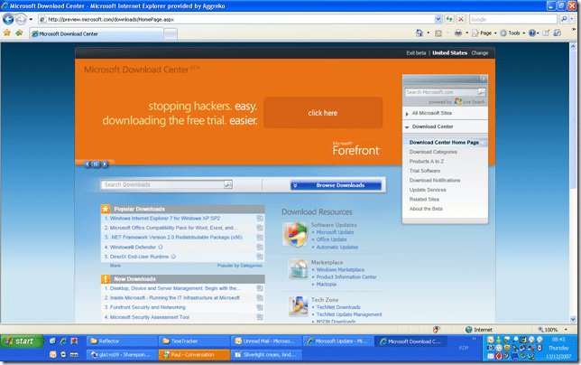

Well, I was browsing the Microsoft downloads site looking for SP1 for SharePoint and a wee popup asked if I would like to see the [http://download.microsoft.com](http://download.microsoft.com) beta...

{ .post-img }

You can view it at [http://preview.microsoft.com/downloads/HomePage.aspx](http://preview.microsoft.com/downloads/HomePage.aspx "http://preview.microsoft.com/downloads/HomePage.aspx") and see what you think. My [Silverlight](http://silverlight.net/) guru collogue Charlie Holland is currently pulling the site apart to see how it ticks...

Good luck 
{ .post-img }

I have been finding it interesting the even recent additions to Microsoft's web content has been in Flash and I am glad to see some movement towards [dogfooding](http://www.panopticoncentral.net/archive/2004/12/10/2828.aspx) Silverlight...

Technorati Tags: [SP 2007](http://technorati.com/tags/SP+2007) [Silverlight](http://technorati.com/tags/Silverlight)
