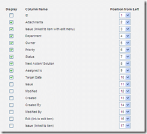

[This seams to be a common problem, and one that I get many calls from users about:](http://blog.hinshelwood.com/files/2011/05/GWB-WindowsLiveWriter-UniqueIDinSharePointlist_7B3D-image_2.png)

{ .post-img }

> _I have a query with our Sharepoint site and was advised that you were probably the best person to ask._
>
> _I have created a list under:_
>
> [_http://sharepoint/sites/department/Lists/ListName/AllItems.aspx_](http://sharepoint/sites/department/Lists/ListName/AllItems.aspx)
>
> _I need the first column (Issue ID) to be an automatically generated number but can’t seem to get it.  Would it be possible for you to take a look and advise?_

You can't add a new unique auto-generated ID to a SharePoint list, but there already is one there! If you edit the "All Items" view you will see a list of columns that do not have the display option checked.

There are quite a few of these columns that exist but that are never displayed, like "Created By" and "Created". These fields are used within SharePoint, but they are not displayed by default so as not to clutter up the display. You can't edit these fields, but you can display them to the user. if you check the "Display" box beside the ID field you will get a unique and auto-generated ID field displayed in your list.

Technorati Tags: [SP 2007](http://technorati.com/tags/SP+2007) [Answers](http://technorati.com/tags/Answers) [SP 2010](http://technorati.com/tags/SP+2010) [SharePoint](http://technorati.com/tags/SharePoint)
