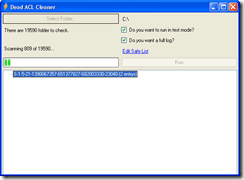

[](http://blog.hinshelwood.com/files/2011/05/GWB-WindowsLiveWriter-RemovingACLsfordeadADaccounts_C3E6-image_2.png) I have run into a very vexing problem with one of my applications. I was asked to provide an application that would fin all of the permissions set against Active Directory accounts that have been since removed. These normally show up in the permissions dialogs for folders as the full SID of the account as there is no longer nay way to look it up in Active Directory.
{ .post-img }

[](http://blog.hinshelwood.com/files/2011/05/GWB-WindowsLiveWriter-RemovingACLsfordeadADaccounts_C3E6-image_4.png)I have written a nice little threaded application that lets you select a folder and it finds all of the dead accounts. What it actually does is verify all accounts against Active Directory and flags them if they are not found. This will have the side effect of finding groups and local accounts and thinking they are dead as well. To solve this problem I added a "Safe List" of accounts and as way to add them from the GUI. The system then ignores any account names that are in this list.
{ .post-img }

All is well...

But not really. As I moved on to actually deleting the offending ACL's on request, I found it was a little more difficult to actually delete them as .NET seams to ignore my code...

> ```
> Private Sub RemoveACL(ByVal DirectoryName As String, _
>                       ByVal IdentityReference As Security.Principal.IdentityReference)
>     Dim DS As DirectorySecurity
>     DS = System.IO.Directory.GetAccessControl(DirectoryName)
>
>     DS.PurgeAccessRules(IdentityReference)
>     DS.PurgeAuditRules(IdentityReference)
>
>     System.IO.Directory.SetAccessControl(DirectoryName, DS)
> End Sub
> ```
>
> [](http://11011.net/software/vspaste)

Now, this code is fairly simple. First we get the directory security object, then we change the directory security object, and then we save the directory security object.

The "DirectoryName" object contains a CuteFTP folder:

[](http://blog.hinshelwood.com/files/2011/05/GWB-WindowsLiveWriter-RemovingACLsfordeadADaccounts_C3E6-image_6.png)
{ .post-img }

The "IdentityReference" object contains the offending SID:

[](http://blog.hinshelwood.com/files/2011/05/GWB-WindowsLiveWriter-RemovingACLsfordeadADaccounts_C3E6-image_8.png)
{ .post-img }

This code should work, and I have used a similar piece to add permissions, so why on earth can't I remove them!

**UPDATE:** [**I have added a question about this to the MSDN Forums**](http://forums.microsoft.com/MSDN/ShowPost.aspx?PostID=2722189&SiteID=1&mode=1)

Technorati Tags: [.NET](http://technorati.com/tags/.NET)
