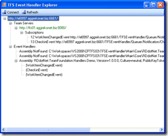
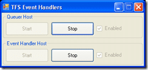

I have just released a [new version](http://www.codeplex.com/TFSEventHandler/Release/ProjectReleases.aspx?ReleaseId=3910) of the [TFS](http://msdn2.microsoft.com/en-us/teamsystem/aa718934.aspx "Team Foundation Server") Event Handler. This is a really rough version and you should not be used in a production environment.

Event handler system will work in this version, but a manual config is required, and the user interface is a bit flaky. Also all errors that occur in an individual handlers are ignored.

If you are planning to use this in a production environment please consider using the [TFS Event Handler (Prototype)](http://www.codeplex.com/TFSEventHandler/Release/ProjectReleases.aspx?ReleaseId=5057).

I will probably not be doing any documentation for this version, but I will be updating frequently as I will be using it on my production server and building Event handlers for it.

{ .post-img }

The Client application allows you to connect to any TFS Event Handler and see what the status is. Please note that there is a bug that occurs when you add a new team server that means that it never authenticates. Once you have added it, close the UI and reopen it to solve the problem. Oh, and don't click the "refresh" button (I said the UI was rough).

{ .post-img }

It will take time to augment the UI and I have quite a few ideas in that regard. One of my goals is to allow the upload of "Packages" that contain all the files  necessary to run en Event Handler that might well have supporting files, like html templates for emails...

At the moment the server component runs in a form, but that will eventually be a service.

{ .post-img }

Hopefully buy the end of next week I will have a version of the service stable enough to run as a service, and a version of the UI integrated with Visual Studio 2008.

Well, that's the plan... 
{ .post-img }

Edited for bad English and down right sloppiness... Made me sound like English was not my first language...

Technorati Tags: [.NET](http://technorati.com/tags/.NET) [ALM](http://technorati.com/tags/ALM) [WIT](http://technorati.com/tags/WIT) [VS 2008](http://technorati.com/tags/VS+2008)
