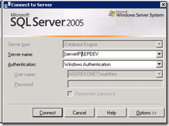
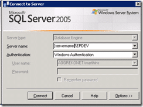
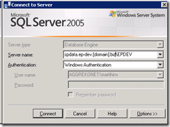

If you want to connect to a SQL server using DNS you will need to have both the "_SQL Server Browser_" service and an SPN setup in your domain to allow authentication.

This allows the DNS name that you have setup to authenticate against the SQL Server using integrated authentication.

> setspn MSSQLSvc/spdata.ep-dev.\[domain\].biz:1422 \[servername\]  
> setspn MSSQLSvc/spdata.ep-dev.\[domain\].biz:1433 \[servername\]

You will know that you need to do this if all of the below is true:

1. Pining your domain brings back the correct IP of the server
2. You can connect to the SQL Server using the server name with Windows Authentication.
3. You can connect to the SQL server using the IP address with Windows Authentication.
4. You can NOT connect to the SQL server using the spdata.ep-dev.\[domain\].biz with Windows Authentication.
5. You can connect to the SQL server using the spdata.ep-dev.\[domain\].biz with SQL Server Authentication.

      
{ .post-img }

{ .post-img }

You can get he setspn tool from the Windows Server 2003 Admin Pack.

Use it to see what SPN's already exist and to see how you can utilise them. For example calling setspn on my \[servername\] produced:

> C:>setspn \[servername\]  
> Registered ServicePrincipalNames for CN=\[servername\],OU=Member Servers,DC=\[domain\],DC=biz:  
>     MSSQLSvc/\[servername\].\[domain\].biz:1422  
>     MSSQLSvc/\[servername\].\[domain\].biz:1433  
>     SMTPSVC/\[servername\]  
>     SMTPSVC/\[servername\].\[domain\].biz  
>     HOST/\[servername\].\[domain\]onet.biz  
>     HOST/\[servername\]

this information helped me identify that the first two "MSSQLSvc" spn's would need to be added to this server. You can add SPN's to accounts as well, but if you only need to access a single server then adding it to an account is a little overkill and probably a security risk.

I'm off to make a request for infrastructure to run this...
{ .post-img }

Technorati Tags: [SP 2007](http://technorati.com/tags/SP+2007)

