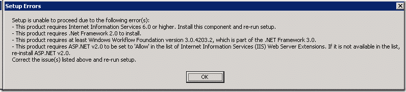
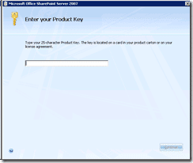
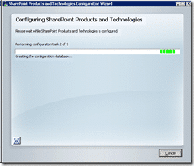

I am having occasion to rebuild my Microsoft Office SharePoint Server (MOSS) development server. In fact, I killed it by adding a Business Data Catalog (BDC) that pointed to a table that had just over a million rows... Now, maybe this would not have caused a problem if I was not using a single server deployment with SQL server on the same box...

That's the way the OS crumbles 
{ .post-img }

Anyway, I am installing from a blank VM helpfully provided by our Infrastructure team. The plan is to install all updates before installing MOSS, this includes .NET 3.5 as some of the applications I will be putting on the server will be using it.

{ .post-img }

If you just try and run the MOSS install you get a nice little message detailing what you need to install as pre-requisites. I have my .NET 3.5 install running, so that should take care of all but IIS...

## Install SQL

You will need SQL Server installed. As this is a development box and I don't have any licensing consideration for development environments under our enterprise agreement I am using "Developer Edition" which is identical to "Enterprise Edition" of SQL Server. And I am not using a default instance. I will soon be in the possession of a SQL Server 2005 Cluster and all of my systems. SharePoint and [TFS](http://msdn2.microsoft.com/en-us/teamsystem/aa718934.aspx "Team Foundation Server") will have their databases moved onto that server.

Now, due to the security requirements of these systems (TFS required DBO and SharePoint required DBCreator) Each one will have its own instance.

TFS is easy enough to move between servers, but SharePoint is NOT. It would require a full backup (from within SharePoint) and restore to move the databases. But I have a plan.. the [The SharePoint Plan: Database move headache mitigation](http://blog.hinshelwood.com/archive/2008/01/31/the-sharepoint-plan-database-move-headache-mitigation.aspx), but I have know idea wither it will work.

Anyway, since my SQL Server install is finished...back to the SharePoint install..

## Install Microsoft Office SharePoint Server Enterprise Edition

{ .post-img }

Make sure that you keep your product key safe, as I have lost mine again... 
{ .post-img }

Thank goodness for MSDN...

{ .post-img }

At the end of the install you get prompted to open the Configuration pages. Well, I'm not.. I am going to get a "VM Snapshot" taken of the server at this point. That should allow me to get back to this point at any time...

As Service Pack 1 is now available for SharePoint I want to start with SP1. So the next step is to install WSS 3.0 SP1 and then MOS SP1.

## Installing Windows SharePoint Services 3.0 Service Pack 1

Hopefully if I install SP1 at this time I will not run into all the problems I (and a lot of other people) had [last time](http://blog.hinshelwood.com/archive/2007/12/13/installing-windows-sharepoint-services-3.0-service-pack-1-sp1.aspx "Installing Windows SharePoint Services 3.0 Service Pack 1 (SP1)").

{ .post-img }

Aw, crap.. Running the install automatically ran the Configuration Wizard, which I did not want to do at this time. Well looks like I have to..

{ .post-img }

All is good for the new Database setup and it seams to be running through the tasks of pointing the SharePoint installation at the DNS database name. I really do hope that it allows me to change the database location without messing around with SharePoint backups.

And that's the WSS 3.0 SP1 update on successfully, and with no errors...

## Installing Microsoft Office System Server Service Pack 1

OK, I now have high hopes for this installation as well. After the last one, there does seam to be a likelihood that this will work...

{ .post-img }

Success...Ran though fine...

Well that's it all installed, just waiting for my SPN's so I can start adding sites 
{ .post-img }

Technorati Tags: [SP 2007](http://technorati.com/tags/SP+2007) [MOSS](http://technorati.com/tags/MOSS) [SP 2010](http://technorati.com/tags/SP+2010) [SharePoint](http://technorati.com/tags/SharePoint)
