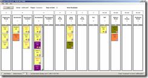

I hade been looking with envy at the [digital whiteboard experiment](http://www.agilemanagement.net/Articles/Weblog/DigitalWhiteboardExperime.html), and with dismay at the lack of open source for the project. So...

 I will be creating a version of the [Sticky Buddy idea](http://www.visualbuilder.com/viewdetail.php?group_id=43&id=532&type=1) that will run off Team Foundation Server and allow teams to display information on the status of their development on one or many projects.
{ .post-img }

The application will be able to be displayed on a projector or large TV screen. The application will consist of a main screen that queries a [TFS](http://msdn2.microsoft.com/en-us/teamsystem/aa718934.aspx "Team Foundation Server") Server and pulls a list of projects that the user can select for display and within each project it will display the iteration tree. This tree will be displayed as a set of concentric columns that are populated with "Change Requests" and "Requirements" that are currently within that iteration path.

Each of the Work Items displayed will show limited information about itself, which user it is assigned to, its Area and title. But it will also display the number of sub items within each item. This will give an indication of the length of time necessary to complete all of the sub-work items within that iteration so it can be moved on to the next.

A set of rules will determine the colour or icons associated with each item based on their status. These rules may include:

- Is this item overdue?
- Does this work item have any blocked work items associated with it?
- Does this work item have any risks associated with it?

The resultant Digital Whiteboard will be displayed in our main offices so we will be dogfooding :)

Technorati Tags: [.NET](http://technorati.com/tags/.NET) [Personal](http://technorati.com/tags/Personal) [ALM](http://technorati.com/tags/ALM) [WIT](http://technorati.com/tags/WIT)
