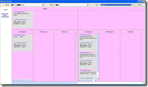
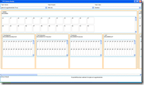

 I had a lot of fun trying to lay out my [TFS Sticky Buddy](http://www.codeplex.com/TFSStickyBuddy) project using Windows Forms, and eventually decided that it was way to fiddle doing it in a Forms based application. It was not just that tables and panels don't work as I expected, but that there were way to many bits that were more difficult than they should be. This is mostly down to my inexperience and down right ineptitude with graphics and UI's, but it still should not be this hard. 
{ .post-img }

I know that the picture on the right is not pretty, and the colours I have picked are pretty random to help solve the layout issues, but the application works....

The problems, as you can see from the image are layout ones. I tried the FlowLayoutPanel, but I could for the life of me, not get the bloody boxes to stretch to fit the contents. Then I used the TableLayoutPanel, and ran into what you see above...Yeuch  (Scottish for Yuck (Like Loch)).
{ .post-img }

I guess I spent too much time doing web development when I was younger, but now when I try to go back to web based stuff I always end up shouting and swearing at the html layouts and growling at the post-back functionality...

What I needed was something that was a cross between Windows Forms, and Web Forms. Something that had good layout functionality, but without the messing around necessary with HTML and CSS. You see, I like HTML and CSS, except for one little thing... It never does what you tell it. At least forms do what you tell them, and that is sometimes the problem with forms, they do ONLY what you tell them.
{ .post-img }

I had only spent a day on the application so far, so I was not overly concerned about the loss of time. I had chosen Windows Forms because I knew it, but deep down I knew that Windows Presentation Foundation was the way to go, I was just scared of the steep clime of understanding...
{ .post-img }

 Sod it...Of I went with a WPF version... And the result were impressive. Not only have I only spent a day and a half on it, but the immediate learning curve is a lot smaller than I though. Sure, you can add styles and templates among other things, but to get what you get with Windows Forms (only prettier) takes less time, not more, even with the learning curve (but I guess that is dependant on how quick you are ). And I am sure that once I master the other functionality provided in WPF it will become much easer.
{ .post-img }

Sure, if you look at the image for the second WPF version you will still see layout problems, but they are minor and fixable (although I am not sure how yet), and the whole thing was a more painless to tweak.

I will try to release these two versions along with the source code today, but just as a POC (Proof of Concept) to show the potential of the application.

I want to have nice little callouts of information when you move your mouse over a work item or Area/Iteration, and I am continuing to work on it....

[Technorati Profile](http://technorati.com/claim/vbgrtargkp)

Technorati Tags: [.NET](http://technorati.com/tags/.NET) [ALM](http://technorati.com/tags/ALM) [WIT](http://technorati.com/tags/WIT) [WPF](http://technorati.com/tags/WPF)

