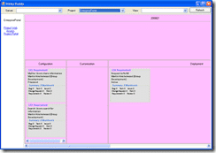

You can now [Download](https://www.codeplex.com/Release/ProjectReleases.aspx?ProjectName=TFSStickyBuddy&ReleaseId=10639 "TFS Sticky Buddy POC (WinForms) release") the [TFS Sticky Buddy windows forms proof of concept demo](http://www.codeplex.com/TFSStickyBuddy/Release/ProjectReleases.aspx "Codeplex RDdotNet TFS Sticky Buddy latest release") from the [Codeplex](http://www.codeplex.com/TFSStickyBuddy "Codeplex RDdotNet TFS Sticky Buddy project") site.
{ .post-img }

This is a proof of concept release of the Team Foundation Server Sticky Buddy digital dashboard project that is built using Windows Forms. This version has layout issues, but is provided as is for demonstration use. The extent of the layout issues will depend on your Area and Iteration layout within the selected project. The source code is provided with the installation.

**Usage**

When the sample starts you will need to select a team foundation server from the list (if you do not see any servers then you must set them up using Team Explorer) which will populate the Projects list. Once you have selected a project the dashboard will be rendered.

**System Requirements**

- .NET Framework 3.5
- Visual Studio 2008 Team Explorer

Give it a go, and let me know how you get on....[WPF version](http://hinshelwood.com/archive/2008/02/11/tfs-sticky-buddy-poc-wpf-release.aspx "TFS Sticky Buddy POC (WPF) release") to follow...

Technorati Tags: [.NET](http://technorati.com/tags/.NET) [ALM](http://technorati.com/tags/ALM) [WIT](http://technorati.com/tags/WIT) [WPF](http://technorati.com/tags/WPF) [VS 2008](http://technorati.com/tags/VS+2008) [TFS](http://technorati.com/tags/TFS)
