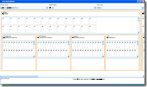

 You can now [Download](https://www.codeplex.com/Release/ProjectReleases.aspx?ProjectName=TFSStickyBuddy&ReleaseId=10642 "TFS Sticky Buddy POC (WPF) release") the [TFS Sticky Buddy windows presentation foundation proof of concept demo](http://www.codeplex.com/TFSStickyBuddy/Release/ProjectReleases.aspx "Codeplex RDdotNet TFS Sticky Buddy latest release") from the [Codeplex](http://www.codeplex.com/TFSStickyBuddy "Codeplex RDdotNet TFS Sticky Buddy project") site.
{ .post-img }

This is a proof of concept release of the Team Foundation Server Sticky Buddy digital dashboard project that is built using Windows Presentation Foundation (WPF). This is the main version of the application as the WinForms version of the application has been deprecated. There are some layout issues with this version, but they should be fixed fro the next release. The source code is provided with the installation.

**Usage**

When the sample starts you will need to select a team foundation server from the list (if you do not see any servers then you must set them up using Team Explorer) which will populate the Projects list. Once you have selected a project the dashboard will be rendered.

**System Requirements**

- .NET Framework 3.5
- Visual Studio 2008 Team Explorer

Give it a go, and let me know how you get on.... You can also get a [WinForm](http://hinshelwood.com/archive/2008/02/11/tfs-sticky-buddy-poc-winforms-release.aspx "TFS Sticky Buddy POC (WinForms) release") version of the application.

Technorati Tags: [ALM](http://technorati.com/tags/ALM) [TFS 2008](http://technorati.com/tags/TFS+2008) [TFS 2005](http://technorati.com/tags/TFS+2005) [WPF](http://technorati.com/tags/WPF) [VS 2008](http://technorati.com/tags/VS+2008) [TFS](http://technorati.com/tags/TFS)
