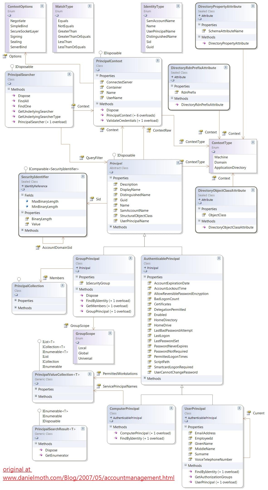

```
Imports System.DirectoryServices.AccountManagement
```

[](http://11011.net/software/vspaste)

[](http://www.danielmoth.com/Blog/AccountManagement-1-1.jpg "Account Management") In WPF development you can't just use the "My.User.Name" classes as it is not set by default. If you still want to use it you can _"My.User.InitializeWithWindowsUser()"_ to have it setup, but there is a better way.
{ .post-img }

If you are using Active Directory .Net 3.5 has provided a new way to access information...

There is a new assembly called "System.DirectoryServices.AccountManagement" that encapsulates all of the logic for accessing security information in a number of ways.

You can create a link to your local Active Directory  by calling:

> ```
>  Dim ctx As New PrincipalContext(ContextType.Domain)
> ```
>
> [](http://11011.net/software/vspaste)

The options for conencting are:

- **ApplicationDirectory** - The application directory store. This represents the AD LDS store.

- **Domain** - The domain store. This represents the AD DS store.

- **Machine** - The computer store. This represents the SAM store.

These options allow for most security authentications in your .NET applications, and it does not stop with wrapping the top level AD. if you want to access and control a user you need only:

> ```
> Dim u As UserPrincipal = UserPrincipal.FindByIdentity(ctx, IdentityType.Sid, WindowsIdentity.GetCurrent.User.Value)
> ```
>
> [](http://11011.net/software/vspaste)

I really like this as often I have has to build and Google (more the later than the former) class library for manipulating Active Directory objects, and you need not just use the Sid. You can use:

- **DistinguishedName** - The identity is a Distinguished Name (DN).

- **Guid** - The identity is a Globally Unique Identifier (GUID).

- **Name** - The identity is a name.

- **SamAccountName** - The identity is a Security Account Manager (SAM) name.

- **Sid** - The identity is a Security Identifier (SID) in Security Descriptor Definition Language (SDDL) format.

- **UserPrincipalName** - The identity is a User Principal Name (UPN).

And this is just the direct load of a user object. There are Group object as well as fill search capability with the PrincipalSearcher and various other bits and bobs...

Well thats my find of the day 
{ .post-img }

Technorati Tags: [.NET](http://technorati.com/tags/.NET) [WPF](http://technorati.com/tags/WPF)
