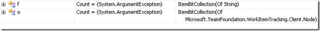

I seam to be having a little problem. Now, this may be me being stupid, but I can't get an ObservableCollection to work if you pass it a generic type!

For example, consider the following code:

> ```
> Public Class ItemBitCollection(Of TItem)
>     Inherits ObservableCollection(Of ItemBit(Of TItem))
> 
> 
> End Class
> 
> Public Class ItemBit(Of TItem)
> 
>     Private m_item As TItem
> 
> End Class
> 
> ```

Now, if you create an instance of ItemBitCollection you will see an error on the IDE regardless of wither you use a custom object type or a String type to initialise it:

[](http://blog.hinshelwood.com/files/2011/05/GWB-WindowsLiveWriter-BuginObservableCollection_9BAF-image_2.png)
{ .post-img }

Why does this not work? What is ObservableCollection doing that maybe it should not? Time to get Reflector out...

After some looking at the source I am still none the wiser. Even if you dumb down your classes to the bare minimum you cant pass a generic type into an ObservableCollection.

This is a limitation if you ask me...

**Annoying solution:**

If you create a fixed class type:

> ```
> Public Class ItemBitCollection(Of TItemBit)
>     Inherits ObservableCollection(Of TItemBit)
> 
> End Class
> 
> Public MustInherit Class ItemBit(Of TItem)
> 
>     Private m_item As TItem
> 
> End Class
> 
> Public Class DefaultItemBit
>     Inherits ItemBit(Of String)
> 
> End Class
> 
> ```
> 
>  

And then pass that class in it does work:

> ```
> Dim o As New ItemBitCollection(Of DefaultItemBit)
> ```
> 
> [](http://11011.net/software/vspaste)

Although this is a work around, it causes other problems in my code... Ahh well... worth a try...

Technorati Tags: [.NET](http://technorati.com/tags/.NET) [WPF](http://technorati.com/tags/WPF)


