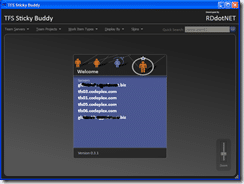

 There is a Community Technology Preview release of the [Team Foundation Server Sticky Buddy](http://www.codeplex.com/TFSStickyBuddy) digital dashboard project that is built using Windows Presentation Foundation (WPF). I have used the source code from the Family.Show project to create functionality and a look that is appealing.
{ .post-img }

You can download it from the [Codeplex site](http://www.codeplex.com/TFSStickyBuddy) and you can raise bugs with the [issue tracker](http://www.codeplex.com/TFSStickyBuddy/WorkItem/List.aspx)...

Please remember that this is a CTP and is not fully functional. With this version you can see how your Areas and Iterations tree diagrammatically. I intend to display the work items within the body of the node and display a different view depending on the zoom level...

{ .post-img }

I have yet to skin the whole application so you will see some bitts that look exactly like the [Family.Show](http://www.vertigo.com/familyshow.aspx) application from [Vertigo](http://www.vertigo.com)... yes I know.. I am a lazy developer...

Technorati Tags: [.NET](http://technorati.com/tags/.NET) [Personal](http://technorati.com/tags/Personal) [ALM](http://technorati.com/tags/ALM) [WPF](http://technorati.com/tags/WPF) [WIT](http://technorati.com/tags/WIT)
