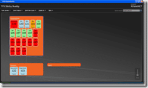
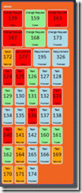
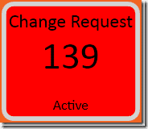

All to soon and it is that time again...I have been developing, hell bent on getting a [working sticky buddy](http://www.codeplex.com/TFSStickyBuddy) online, and here it is...

[**Download TFS Stick Buddy v0.4.0 CTP2 Now**](http://www.codeplex.com/TFSStickyBuddy/Release/ProjectReleases.aspx)**...**

{ .post-img }

With this version you can select what work items you want to display by choosing a Query from the list. You can add queries to your list through Visual Studio and the TFS Web Access power tool to allow customisation of the display for your needs and project template types. If you do not have a work item called "Requirement" and instead use one called "Customer Request" then you just need to make a query that pulls this information back.

{ .post-img }

When you open [TFS Sticky Buddy](http://www.codeplex.com/TFSStickyBuddy) you will be asked to select a Team Server to connect to. If you have a proxy, like I do in the office, you will not be able to connect to an external TFS server through it as your credentials will be wrong... maybe I need a [work item](http://www.codeplex.com/TFSStickyBuddy/WorkItem/List.aspx) for that 
{ .post-img }

Once you have selected your team server you will need to wait for it to authenticate, but I added a little "loading" window to keep you happy as it may take a little while to authenticate depending on the speed on your network and the load on your TFS server.

When the load it complete you will have access to the menu options, but it will have automatically loaded the first Team Project on your server and the first work item query on your project (which tends to be "Active bugs").

{ .post-img }

If you have this many bugs, you may need to invest more in quality control...

The application will load all of your Areas and their hierarchy by default and display any work items in your selected query on that Area. You can see that it will display everything on the node and colour code it depending on the state of the work item:

- Proposed = Blue 
  { .post-img }
- Active = Red 
  { .post-img }
- Resolved = Amber 
  { .post-img }
- Closed = Green 
  { .post-img }

I plan to have other options, but I will need to make some changes to the skining files, but you get the picture...

{ .post-img }

I hope everyone "team servery" has a go, and don't be shy about [reporting bugs](http://www.codeplex.com/TFSStickyBuddy/WorkItem/List.aspx) and [requesting features](http://www.codeplex.com/TFSStickyBuddy/WorkItem/List.aspx).

You can even use the [discussion forums](http://www.codeplex.com/TFSStickyBuddy/Thread/List.aspx)...

[**Download TFS Stick Buddy v0.4.0 CTP2 Now**](http://www.codeplex.com/TFSStickyBuddy/Release/ProjectReleases.aspx)**...**

Technorati Tags: [.NET](http://technorati.com/tags/.NET) [Personal](http://technorati.com/tags/Personal) [ALM](http://technorati.com/tags/ALM) [WPF](http://technorati.com/tags/WPF) [WIT](http://technorati.com/tags/WIT)
