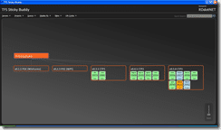

As you have probably noticed I have been soldiering on with the [TFS Sticky Buddy](http://www.codeplex.com/TFSStickyBuddy) project, and I though I would share.

{ .post-img }

With the next release you will be able to connect to any external (not on same domain) [TFS](http://msdn2.microsoft.com/en-us/teamsystem/aa718934.aspx "Team Foundation Server") server including [CodePlex](http://www.codeplex.com "CodePlex") servers and load up your projects. The [TFS Sticky Buddy](http://www.codeplex.com/TFSStickyBuddy) guest stars above.

{ .post-img }

One of the major improvements is the ability to add skins for different TFS life Cycles. I have a "Default" setting and you can change it to the [Codeplex](http://www.codeplex.com) Template. Over time I will be adding others, but I only have access to [CodePlex](http://www.codeplex.com "CodePlex"), and my local production TFS server, so if you want a custom one, you may need to build it yourself...

If you want a go of these features you will need to [download the source](http://www.codeplex.com/TFSStickyBuddy/SourceControl/ListDownloadableCommits.aspx) and build the main folder code... but there will be a release soon..

Technorati Tags: [.NET](http://technorati.com/tags/.NET) [Personal](http://technorati.com/tags/Personal) [ALM](http://technorati.com/tags/ALM) [WPF](http://technorati.com/tags/WPF) [WIT](http://technorati.com/tags/WIT)
