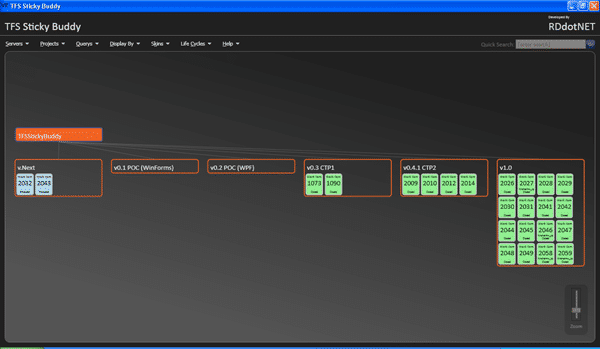

This is the first [full release](http://www.codeplex.com/TFSStickyBuddy/Release/ProjectReleases.aspx) of the [TFS Sticky Buddy application](http://www.codeplex.com/TFSStickyBuddy) written in VB.NET 9 and WPF with Visual Studio 2008 Team Suit.

{ .post-img }

The application provides a graphical view of TFS Work Items and allow user to navigate round either the Area (Codeplex Component) or Iteration (Codeplex Release) tree. It displays all the work items loaded (by selecting a Team Query) on the node, colour coded by Work Item State.

You can edit and add templates for displaying Work Items loaded for different Life Cycle templates in Team Foundation Server by editing the XAML in the Life Cycle resource directory (#InstallLocation#RDdotNetTFS Sticky BuddyResourcesLifeCycle\[Name\]\[Name\]Resources.xaml) and editing the resource file. Though I would suggest creating a new file for each Life Cycle you want to display. Out of the box I have supported a Default option that works for most TFS Process Templates, and a Codeplex option for supporting your Codeplex projects.

**Usage**

When the TFS Sticky Buddy application starts you will be prompted to select a team foundation server from the list (if you do not see any servers then you must set them up using Team Explorer) which will populate the Projects and other menus. The navigation diagram will by default render the first project in your selected TFS server.

Use the "Queries" menu to select which work items that you want loaded into your view.

**System Requirements**

.NET Framework 3.5 Visual Studio 2008 Team Explorer (not forced) Access to a Team Foundation Server (not provided)

If you already have CTP1 or CTP2 you should [update](http://www.codeplex.com/TFSStickyBuddy/Release/ProjectReleases.aspx) to the [full release now](http://www.codeplex.com/TFSStickyBuddy/Release/ProjectReleases.aspx)...

Technorati Tags: [Personal](http://technorati.com/tags/Personal) [ALM](http://technorati.com/tags/ALM) [WPF](http://technorati.com/tags/WPF) [WIT](http://technorati.com/tags/WIT) [VS 2008](http://technorati.com/tags/VS+2008) [TFS](http://technorati.com/tags/TFS)
