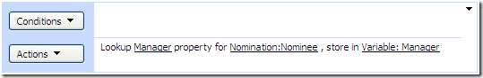

I have been using the [Useful Sharepoint Designer Custom Workflow Activities](http://www.codeplex.com/SPDActivities/) project on [CodePlex](http://www.codeplex.com "CodePlex") to augment the capabilities of SharePoint Designer to add such features as "Start another workflow" which is very useful for compartmentalising your workflow so as to not make it too complicated.

{ .post-img }

Well I found a wee problem. The "**[Lookup user info](http://www.codeplex.com/SPDActivities/Wiki/View.aspx?title=Lookup%20user%20info&referringTitle=Home)**" activity only looks up information from the site and not from the users MOSS profile. So I started another [CodePlex](http://www.codeplex.com "CodePlex") project for activities I will be building and I am creating once called "[Lookup user profile](http://www.codeplex.com/MOSSActivities/Wiki/View.aspx?title=Lookup%20user%20profile&referringTitle=Home)" on my shiny new [MOSS Designer Workflow Activities](http://www.codeplex.com/MOSSActivities) project.

This one Activity will alleviate my immediate need, but I can see many more in the future...

Technorati Tags: [Personal](http://technorati.com/tags/Personal) [SP 2007](http://technorati.com/tags/SP+2007) [MOSS](http://technorati.com/tags/MOSS) [SharePoint](http://technorati.com/tags/SharePoint)

