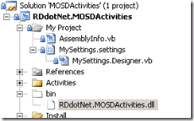
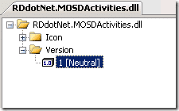
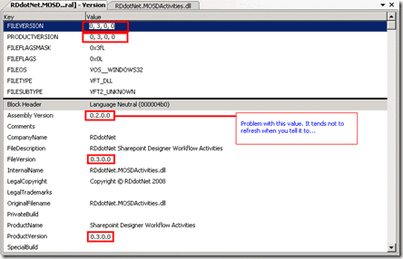

 If you are having an issue with the assembly version in your compiled assembly not updating after a rebuild then you are not alone. The is a bug in the Visual Basic compiler that causes this problem and it requires a manual fix:
{ .post-img }

[http://kbalertz.com/952628/Assembly-Version-change-Visual-Basic-Workflow-projects.aspx](http://kbalertz.com/952628/Assembly-Version-change-Visual-Basic-Workflow-projects.aspx "http://kbalertz.com/952628/Assembly-Version-change-Visual-Basic-Workflow-projects.aspx")

Not hard, but annoying...

To check the problem, double click on the assembly in your bin folder and open out the version tag.
{ .post-img }

You can see from the image below what I am getting at. This causes no end of problems with signed assemblies. The KBAlertz article above implies that this only affects Workflow assemblies. But I have has t6his problem in other types of Visual Basic project.
{ .post-img }

This is not a big problem unless you are creating custom assemblies for SharePoint and have a convoluted deployment process before you can test, and can't figure out why you changes are not going through...

Technorati Tags: [.NET](http://technorati.com/tags/.NET) [SP 2007](http://technorati.com/tags/SP+2007)
