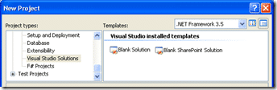

<Rant>

There needs to be a way to easily build MOSS Solutions in Visual Studio. I know that there are a bunch of bits and pieces available form Microsoft and third parties, but I want an end to end solution.
{ .post-img }

You should be able to create a SharePoint "Solution" in Visual Studio. Then Add Feature projects to it that can contain many list or site bits with the ability to compile and build the solution file that can be uploaded into SharePoint with out all of this faffing around...

Oh, and you should be able to do it remotely! On a workstation!

</Rant>

Technorati Tags: [MOSS](http://technorati.com/tags/MOSS) [Personal](http://technorati.com/tags/Personal) [Fail](http://technorati.com/tags/Fail) [SP 2007](http://technorati.com/tags/SP+2007) [SharePoint](http://technorati.com/tags/SharePoint)
