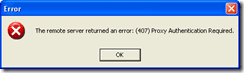

If like me you want to try the rather [groovy sync tool for Outlook](http://blogs.msdn.com/lokeuei/archive/2007/09/12/outsync-outlook-facebook-sync-released.aspx) that syncs your contacts (and pictures ) with your outlook contacts, which will then be displayed on your mobile phone, and you are behind a proxy server, then this info is for you…
{ .post-img }

**NOTE: This will work for any .NET application where the developer has not already set it…**

Open the \[applicationname\].config file in the install location and add:

> <system.net>  
>   <defaultProxy useDefaultCredentials="true">  
>     <proxy usesystemdefault="True" />  
>   </defaultProxy>  
> </system.net>

Just above the closing </configuration> tags. This will allow your application to authenticate with a proxy server…

Technorati Tags: [.NET](http://technorati.com/tags/.NET) [Personal](http://technorati.com/tags/Personal)

