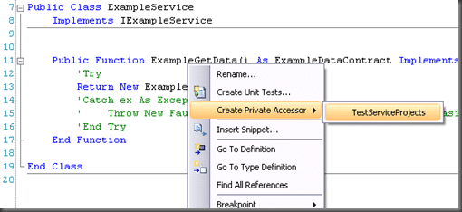
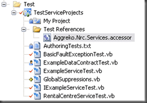

There seams to be a problem in MSBuild when you add an “Accessor” as part of a Unit Test project.

> ```
> C:Program FilesMSBuildMicrosoftVisualStudiov9.0TeamTestMicrosoft.TeamTest.targets(14,5): error MSB4018: The "BuildShadowTask" task failed unexpectedly.
> System.IO.FileLoadException: API restriction: The assembly 'file:///C:WINDOWSMicrosoft.NETFrameworkv2.0.50727System.Web.dll' has already loaded from a different location. It cannot be loaded from a new location within the same appdomain.
>    at System.Reflection.Assembly._nLoad(AssemblyName fileName, String codeBase, Evidence assemblySecurity, Assembly locationHint, StackCrawlMark& stackMark, Boolean throwOnFileNotFound, Boolean forIntrospection)
>    at System.Reflection.Assembly.nLoad(AssemblyName fileName, String codeBase, Evidence assemblySecurity, Assembly locationHint, StackCrawlMark& stackMark, Boolean throwOnFileNotFound, Boolean forIntrospection)
>    at System.Reflection.Assembly.InternalLoad(AssemblyName assemblyRef, Evidence assemblySecurity, StackCrawlMark& stackMark, Boolean forIntrospection)
>    at System.Reflection.Assembly.InternalLoadFrom(String assemblyFile, Evidence securityEvidence, Byte[] hashValue, AssemblyHashAlgorithm hashAlgorithm, Boolean forIntrospection, StackCrawlMark& stackMark)
>    at System.Reflection.Assembly.ReflectionOnlyLoadFrom(String assemblyFile)
>    at Microsoft.VisualStudio.TestTools.UnitTesting.Publicize.WebBinder.LoadData()
>    at Microsoft.VisualStudio.TestTools.UnitTesting.Publicize.WebBinder.Init()
>    at Microsoft.VisualStudio.TestTools.UnitTesting.Publicize.Shadower..ctor()
>    at Microsoft.VisualStudio.TestTools.BuildShadowReferences.BuildShadowTask.Execute()
>    at Microsoft.Build.BuildEngine.TaskEngine.ExecuteInstantiatedTask(EngineProxy engineProxy, ItemBucket bucket, TaskExecutionMode howToExecuteTask, ITask task, Boolean& taskResult)
> ```

An Accessor allows your test project to access code that would normally be “Private” or “Friend” from outside the Assembly that it resides in.

[](http://blog.hinshelwood.com/files/2011/05/GWB-WindowsLiveWriter-TFSErrorMSB4018TheBuildShadowTasktaskfai_EDA9-image_2.png)
{ .post-img }

It creates a little file with the “.accessor” extension that is the same name as your DLL, and contains the name of the DLL.

[](http://blog.hinshelwood.com/files/2011/05/GWB-WindowsLiveWriter-TFSErrorMSB4018TheBuildShadowTasktaskfai_EDA9-image_4.png)
{ .post-img }

If you remove this file then your remote MSBuild server will then build you solution successfully again including running your Unit Tests.

Reference:

[Re: BuildShadowTask Failed unexpectedly - Accessor Problem (Upconvert VS 2005 to 2008) – URGENT](http://forums.microsoft.com/msdn/ShowPost.aspx?PageIndex=1&SiteID=1&PageID=1&PostID=3419493)

[BuildShadowTask Failed unexpectedly - Accessor Problem (Upconvert VS 2005 to 2008) – URGENT](http://forums.microsoft.com/msdn/ShowPost.aspx?PostID=2941701&SiteID=1)

Technorati Tags: [ALM](http://technorati.com/tags/ALM) [TFBS](http://technorati.com/tags/TFBS) [TFS 2008](http://technorati.com/tags/TFS+2008) [VS 2005](http://technorati.com/tags/VS+2005)
