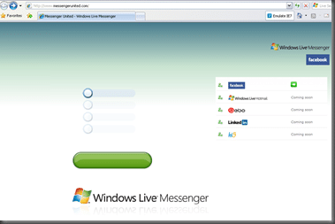

Although the site is a little skewed today…

{ .post-img }

…This is an [excellent application](http://www.messengerunited.com/). Role on the LinkedIn sync.

When you click the button (the big green one) you get taken to [another site](http://www.messengerunited.com/) that has the actual application on it.

{ .post-img }

This it seams is part of Microsoft's Connected Systems initiative that Bill has been pushing for years. They are now starting to open up their services (recently with their Exchange and Messenger products) to allow better integration with third parties.

For those that do not use Hotmail (perish the thought) the only sync / import available is the Facebook one.

Technorati Tags: [Live](http://technorati.com/tags/Live) [Answers](http://technorati.com/tags/Answers)
