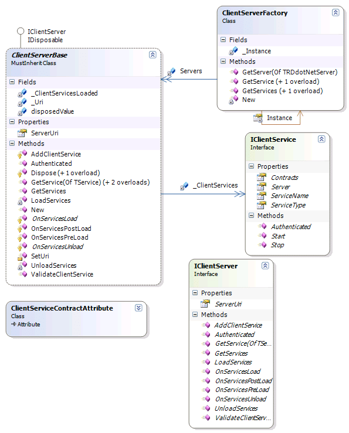

A while a go I create a [Service Manager](http://blog.hinshelwood.com/articles/Creating-a-managed-service-factory-Article.aspx). A way of wrapping local and remote services (widgets, bits, things) for use in any application within your business or just in your own code…

I made the source available before, but as I am now going to be using and updating it again, I have created a [Codeplex Project](http://codeplex.com/ServiceManager) for it and put it up on [my own site](http://hinshelwood.com/ServiceManager.aspx) and called it [.NET Service Manager](http://hinshelwood.com/ServiceManager.aspx).

You can download the source code, and in a very short while I will have a first release up…

It is quite simple, but has a plethora of uses… One of the best is creating Client side API’s for web services and components of applications…

{ .post-img }

Technorati Tags: [WCF](http://technorati.com/tags/WCF)
