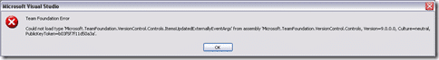

I received the following error box after installing VS2008 SP1 RTM:

{ .post-img }

> Team Foundation Error
>
> Could not load type ‘Microsoft.TeamFoundation.VersionControl.Controls.ItemsUpdatedExternallyEventArgs’ from assembly ‘Microsoft.TeamFoundation.VersionControl.Controls, Version=9.0.0.0, Culture=neutral, PublicKeyToken=b03f57f11d50a3a

This stopped me accessing version control…a key part if you ask me.

The first thing I tried was to “Repair” Team Explorer, but that did not help, so I had a wee google…and found:

[Problem of Team Explorer after installed Visual Studio 2008 SP1 beta](http://dotnet.robertmao.com/2008/05/27/problem-of-team-explorer-after-installed-visual-studio-2008-sp1-beta/) which lead me to [Re: Bug after installer the SP1 with work items](http://forums.microsoft.com/msdn/ShowPost.aspx?PostID=3380330&SiteID=1) and thus to the old favourite “reinstall the service pack!”

I have opened a thread ([Problems with Team Explorer after installed Visual Studio 2008 SP1 RTM](http://forums.microsoft.com/msdn/ShowPost.aspx?PostID=3736501&SiteID=1)) on the MSDN forums…

If the reinstall of the SP fixes my problem, I will update there…

**Update 2008-08-14: Nope, no fixie... I have sent my workstation to helpdesk for a rebuild. Humph!**

**Update 2008-08-15: I have installed SP1 sucessfully on 3 other computers.... Even ones that already had SP1 Beta1... Must just have been my workstation... double humph!**

Technorati Tags: [ALM](http://technorati.com/tags/ALM) [VS 2008](http://technorati.com/tags/VS+2008)
