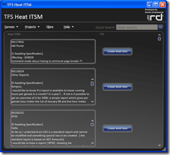

In Aggreko we use a product called Heat ITSM to manage our support calls.  Now all of these calls are tracked using its tracking system, but we (Group Development) want to track using Team System. We need some way of moving and syncing items between these two systems.
{ .post-img }

 I completed the first part by using my [TFS Event Handler](http://hinshelwood.com/TFSEventHandler.aspx) project and that piece is live. If you put a field on any work item called "HeatITSM.Ref" and you fill it out (manually) with an ID from Heat then every time you change the work item it will update heat with a "Note" attached to that "Call". This was very easy using the [TFS](http://msdn2.microsoft.com/en-us/teamsystem/aa718934.aspx "Team Foundation Server") Event Handler model, but it still means that you need to create the Work Item manually.
{ .post-img }

The next step is to create a [TFS Heat ITSM](http://hinshelwood.com/TFSHeatITSM.aspx) application that loads all the calls for a specific "Application" (category) and allows you to create a Work Item with a single click.

 Well, I have been working on it, and the [Codeplex](http://codeplex.com) site is up, and a initial Alfa application is there, but I an doing a refactor at the moment as things were getting a little complicated and confusing on the code side so a simplification was required.
{ .post-img }

As you can see from the screen shots I am using the [TFS Sticky Buddy](http://hinshelwood.com/TFSStickyBuddy.aspx) base code as a starting point and working from there, although during the refactor I am making a lot of changes that will benefit Sticky Buddy v2.0 as well.

Well, Back to the code face :)

Technorati Tags: [ALM](http://technorati.com/tags/ALM) [Personal](http://technorati.com/tags/Personal) [WPF](http://technorati.com/tags/WPF) [TFS 2008](http://technorati.com/tags/TFS+2008) [TFS](http://technorati.com/tags/TFS)
