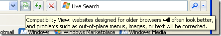

If you were worried about your pages viewing correctly in IE8 Beta 1 you had to restart your browser to enable "IE7 Compatibility mode". Now it is easy:

{ .post-img }

Although it seams to do a bit of detecting and only displays it on certain sites.

For example Microsoft.com and Google.com do not get the little button.

But Gmail does :)

Technorati Tags: [Misc](http://technorati.com/tags/Misc)
