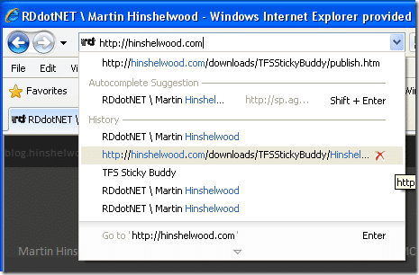

It may be simple, and it may be small, but the feature that hit me first and greatest in IE8 was the address bar enhancements. This feature alone would have me upgrading:

{ .post-img }

This feature alone has improved my efficientcy :) I can find stuff again....

Technorati Tags: [Misc](http://technorati.com/tags/Misc)
