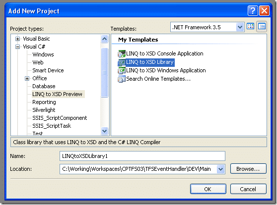

Absolutely brilliant. That's what I think of Linq to XSD. Disappointed that is only works in C#, but having to use C# for a single project out of a solution it is a small price to pay to get the functionality.

If you install the [_LINQ to XSD Preview_ Alpha 0.2 Refresh](http://www.microsoft.com/downloads/details.aspx?FamilyID=A45F58CD-FCFC-439E-B735-8182775560AF&displaylang=en) you get a couple of extra project definitions:

[](http://blog.hinshelwood.com/files/2011/05/GWB-WindowsLiveWriter-LINQtoXSD_D04A-image_2.png)
{ .post-img }

If you create one of these it will have the features enabled. You can add the features to an existing project by editing the project definition file to add a property group:

```
   1: <PropertyGroup>
```

```
   2:   <TXLINQBinDir Condition="'$(TXLINQBinDir)' == ''">$(ProgramFiles)LINQ to XSD PreviewBin</TXLINQBinDir>
```

```
   3: </PropertyGroup>
```

And an import reference:

```
   1: <Import Project="$(TXLINQBinDir)LinqToXsd.targets" />
```

note: if you are using MSBuild or Team Build you will need to install this add on there as well....

Now that you have a project, when you add an XSD you will have extra Build Actions available. Once you have set all of your XSD files to this Action and build, you will have classes for all of your XSD's. On down side is that it created a single file ("/obj/debug/LinqToXsdSource.cs"), bit it does work.

Technorati Tags: [.NET](http://technorati.com/tags/.NET) [TFBS](http://technorati.com/tags/TFBS)
