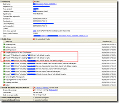

I received a confusing error from MS Build on Friday. I assumed that it was a GDR version issue for the top level message:

{ .post-img }

Now, we have the situation with our Business Intelligence  system where we have 2 solutions. One for Visual Studio 2005 projects that consist solely of the Business Intelligence Package bits, and a 2008 solution which consists of everything else that is needed to build our solution. We do plan to move everything over to 2008, but we are currently targeting SQL Server 2005.

The problem looks like it is to do with the 2008 solution an not the 2005 one:

 
{ .post-img }

But, the error message implies that it is the 2005 solution:

> c:WorkingXxxxxXXX Integration (Main)SourcesXXXDEVMainXXX2005.sln(0,0): warning MSB4126: The specified solution configuration "Release|Any CPU" is invalid. Please specify a valid solution configuration using the Configuration and Platform properties (e.g. MSBuild.exe Solution.sln /p:Configuration=Debug /p:Platform="Any CPU") or leave those properties blank to use the default solution configuration.  
> C:Program FilesMSBuildMicrosoftVisualStudiov9.0TeamDataMicrosoft.Data.Schema.SqlTasks.targets(58,5): error MSB4018: The "SqlBuildTask" task failed unexpectedly.  
> System.NullReferenceException: Object reference not set to an instance of an object.  
>    at Microsoft.VisualStudio.TeamSystem.Data.Tasks.TaskHostLoader.Load(ITaskHost providedHost)  
>    at Microsoft.VisualStudio.TeamSystem.Data.Tasks.DbBuildTask.Execute()  
>    at Microsoft.Build.BuildEngine.TaskEngine.ExecuteInstantiatedTask(EngineProxy engineProxy, ItemBucket bucket, TaskExecutionMode howToExecuteTask, ITask task, Boolean& taskResult)

After reading up, I am none the wiser, but I did find information that implied that installing SP1 for [TFS](http://msdn2.microsoft.com/en-us/teamsystem/aa718934.aspx "Team Foundation Server") should fix the problem and not require that I update the TFS server. We are using GDR bits, so I will be installing GDR 16 and the SQL Server 2008 Business  Intelligence bits.

**UPDATE: So after jut updating the GDR, I got the solution to build! Not sure why there was an error in the 2005 solution!**

Sources:

[http://ozgrant.com/2008/02/28/testcontainer-in-team-build-2008-doesnt-work-for-load-tests-or-web-tests/](http://ozgrant.com/2008/02/28/testcontainer-in-team-build-2008-doesnt-work-for-load-tests-or-web-tests/ "http://ozgrant.com/2008/02/28/testcontainer-in-team-build-2008-doesnt-work-for-load-tests-or-web-tests/")

Technorati Tags: [ALM](http://technorati.com/tags/ALM) [TFBS](http://technorati.com/tags/TFBS) [VS 2005](http://technorati.com/tags/VS+2005)

